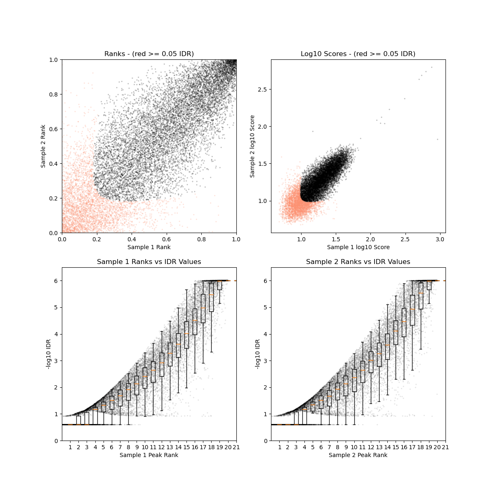
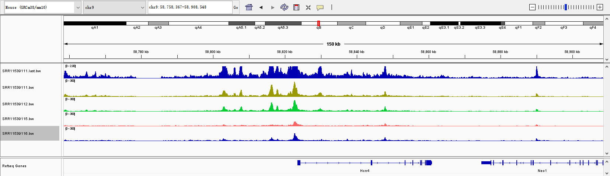
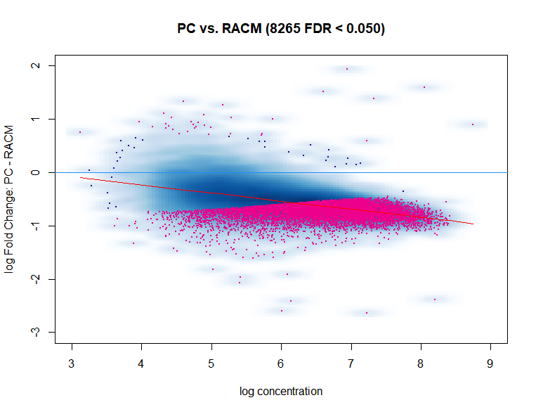
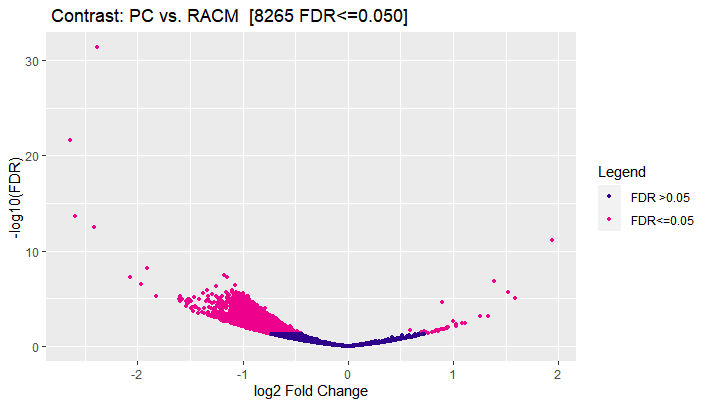
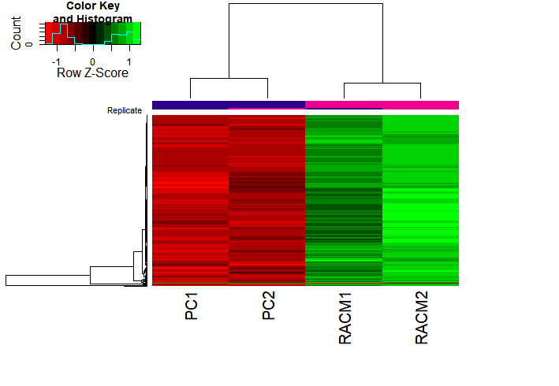

# ATAC-seq分析
[很好的参考文章](https://yiweiniu.github.io/blog/2019/03/ATAC-seq-data-analysis-from-FASTQ-to-peaks/)    
[术语列表](https://www.encodeproject.org/data-standards/terms/#enrichment)   
[文件格式](https://deeptools.readthedocs.io/en/develop/content/help_glossary.html)   


- [0. Introduction](#0-introduction)
- [1. Prepare](#1-Prepare)
- [2. Biotools](#2-Biotools)
    - [2.0 management](#20-management)
    - [2.1 sratoolkit](#21-sratoolkit)
    - [2.2 fastqc](#22-fastqc)
    - [2.3 multiqc](#23-multiqc)
    - [2.4 TrimGalore](#24-TrimGalore)
    - [cutadapt+trimmomatic](#cutadapt+trimmomatic)
    - [2.5 bowtie2](#25-bowtie2)	
    - [2.6 samtools](#26-samtools)
    - [2.7 Picard](#27-Picard)
    - [2.8 bedtools](#28-bedtools)
    - [2.9 MACS2](#29-MACS2)
    - [2.10 IGV](#210-IGV)
    - [2.11 R](#211-R)
    - [2.12 Rstudio](#212-rstudio)
    - [2.13 parallel](#213-parallel)
    - [2.14 IDR](#214-IDR)
    - [2.15 deeptools](#215-deeptools)
    - [2.16 Homer](#215-Homer)
    - [2.15 RGT_HINT-ATAC](#215-RGT_HINT-ATAC)

- [3. Data](#3-Data)
    - [3.1 sequence](#31-sequence)
    - [3.2 genome](#32-genome)
- [4. Pre-alinment](#4-Pre-alinment)
    - [4.1 quality_control_checking](#41-quality_control_checking)
    - [4.2 pre-alinment_QC](#42-pre-alinment_QC)
- [5. Alignment](#5-Alignment)
	- [5.1 alignment](#51-alignment)
	- [5.2 sort_transfertobam_index](#52-sort_transfertobam_index)
- [6. Post-alignment_processing](#6-Post-alignment_processing)
	- [6.1 remove_PCR-duplicate_reads](#61-remove_PCR-duplicate_reads)
	- [6.2 remove_badquality_reads](#62-remove_badquality_reads)
  - [6.3 remove_chrM_reads](#63-remove_chrM_reads)
  - [6.4 Blacklist_filtering](#64-blacklist_filtering)
  - [6.5 bamtobed](#65-bamtobed)
- [Merging BAMs (optional)](#merging-bams-optional)  
- [7. shift_reads](#7-shift_reads)
- [8. call_peaks](#8-call_peaks)
- [9. Quality_check](#9-Quality_check)
	- [9.1 fragment_length_distribution](#91-fragment_length_distribution)
	- [9.2 FRiP](#92-FRiP)
  - [9.3 IDR](#93-idr)
  - [9.4 TSS_enrichment](#94-tss_enrichment) 
  - [9.5 other_indexes](#95-other_indexes) 

- [11. Visualization](#11-visualization)
  - [11.1 filterbam2Bw](#111-filterbam2bw)
  - [11.2 TSS_enrichment](#112-tss_enrichment)

- [12. Peak differential analysis](#12-peak-differential-analysis)
- [13. peak annotation](#13-peak-annotation)  
- [14. Motifs](#14-motifs)
- [15. Footprints](#15-footprints)  
- [14. Motifs](#14-motifs)
- [Reference](#reference)
- [Author](#author)


# 0. Introduction  

ATAC-seq（Assay for Transposase-Accessible Chromatin with high throughput sequencing） 是2013年由斯坦福大学William J. Greenleaf和Howard Y. Chang实验室开发的用于研究染色质可及性（通常也理解为染色质的开放性）的方法，原理是通过转座酶Tn5容易结合在开放染色质的特性，然后对Tn5酶捕获到的DNA序列进行测序。  


ATAC-seq利用DNA转座酶技术实现染色质可及性分析。DNA转座酶可以将自身结合的一段序列随机插入到基因组中。在ATAC-seq试验中，细胞或组织样本在核质分离后，将细胞核单独收集在一起，并通过转座酶Tn5对核内的染色质进行打断。紧密包裹的染色质DNA不会受到转座酶的打断，而开放区域的染色质DNA会被转座酶随机插入并打断。将这些打断后的DNA收集在一起，进行后续的建库、测序、分析，即可得到开放染色质的信息。ATAC-seq中的peak，往往是启动子、增强子序列，以及一些调控因子结合的位点。  

ATAC-seq可用于：  

- 生成表观基因组图谱  

- 得到在不同组织或不同条件下对应可及性区域    

- 得到核小体位置  

- 鉴定重要转录因子  

- 生成转录因子结合区域的特征(footprinting)  

[具体看该文章](https://github.com/outcastaaa/ATAC/blob/main/review%20of%20ATAC-seq.md)  


## 数据分析具体流程：    
预处理（Pre-analysis）包括比对前的质量控制 QC（Pre-alignment QC）、比对（Alignment）、比对后处理（Post alignment processing）、QC。  
核心分析（Core analysis）包括 Peak calling。  
高级分析（Advance analysis）包括 Peak、motif、footprint、nucleosome 分析。  
多组学整合包括与 ChIP-seq、RNA-seq 数据的整合以及调控网络的重建。    

[数据分析详细流程](https://www.ncbi.nlm.nih.gov/pmc/articles/PMC6996192/figure/Fig2/)   


# 1. Prepare  
```bash
#将目录建在d盘 
cd /mnt/d 
# 建立目录，后期逐步添加
mkdir biosoft  
mkdir ATAC    
cd ./ATAC
mkdir genome sequence qc align motif peaks
#查看结构
@xxx:/mnt/d/ATAC$ tree
```

# 2. Biotools 
软件详细用法记录在github的[biotools](https://github.com/outcastaaa/ATAC/tree/main/biotools)文件夹中。  


## 2.0 management  

Linux brew  
来源[wang-q Ubuntu -](https://github.com/wang-q/ubuntu#install-linuxbrew)

## 2.1 sratoolkit   
* 使用brew安装
```bash
@xxx:~$ brew install sratoolkit
```
* [详细使用](https://github.com/outcastaaa/bioinformatics-learning/blob/main/RNA-seq/Tools/SRA%20toolkit.md)  


## 2.2 fastqc  
* 使用brew安装  
```bash
@xxx:~$ brew install fastqc
```
* [详细使用](https://github.com/outcastaaa/bioinformatics-learning/blob/main/RNA-seq/Tools/fastqc.md)  


## 2.3 multiqc 
``` bash
# 使用python的安装器安装
pip install multiqc
```

## 2.4 TrimGalore  

! [作者GitHub](https://github.com/FelixKrueger/TrimGalore)已经更新至2021年7月的0.6.6版本
```bash
cd /mnt/d/biosoft

# Install Trim Galore
curl -fsSL https://github.com/FelixKrueger/TrimGalore/archive/0.6.6.tar.gz -o TrimGalore.tar.gz
tar xvzf TrimGalore.tar.gz

# Run Trim Galore
~/TrimGalore-0.6.6/trim_galore
```
* [详细使用](https://github.com/outcastaaa/bioinformatics-learning/blob/main/RNA-seq/Tools/trim_galore.md)  

## cutadapt+trimmomatic

```bash
pip install cutadapt

#trimmomatic
cd /mnt/d/biosoft
wget http://www.usadellab.org/cms/uploads/supplementary/Trimmomatic/Trimmomatic-0.38.zip
unzip Trimmomatic-0.38.zip
cd Trimmomatic-0.38
export PATH="$(pwd):$PATH"
```
* [详细使用](https://github.com/outcastaaa/ATAC/blob/main/biotools/cutadapt%2BTrimmomatic.md)  


## 2.5 bowtie2
```bash
brew install bowtie2
```
* [详细用法](https://github.com/outcastaaa/ATAC/blob/main/biotools/bowtie2.md)  

## 2.6 samtools
```bash
brew install samtools
```
* [详细用法](https://github.com/outcastaaa/ATAC/blob/main/biotools/samtools_bamfile.md)   


## 2.7 Picard
* 可以直接用brew安装
```bash
brew install picard
```
* 在作者GitHub上安装  
```bash
mkdir -p /mnt/d/biosoft/picard
cd /mnt/d/biosoft/picard
wget https://github.com/broadinstitute/picard/releases/download/2.27.5/picard.jar

```
* [详细用法](https://github.com/outcastaaa/ATAC/blob/main/biotools/Picard.md)   


## 2.8 bedtools
```bash
mkdir -p /mnt/d/biosoft/bedtools
cd /mnt/d/biosoft/bedtools
wget https://github.com/arq5x/bedtools2/releases/download/v2.30.0/bedtools-2.30.0.tar.gz
tar -zxvf bedtools-2.30.0.tar.gz
cd bedtools2
make
```
* [详细用法](https://github.com/outcastaaa/ATAC/blob/main/biotools/bedtools.md)   


## 2.9 MACS2
* [工作原理](https://github.com/hbctraining/In-depth-NGS-Data-Analysis-Course/blob/master/sessionV/lessons/04_peak_calling_macs.md)  

The tag density around a true binding site should show a bimodal enrichment pattern (or paired peaks). MACS takes advantage of this bimodal pattern to empirically model the shifting size to better locate the precise binding sites.

To find paired peaks to build the model, MACS first scans the whole dataset searching for highly significant enriched regions. This is done only using the ChIP sample! Given a sonication size () and a high-confidence fold-enrichment (), MACS slides two windows across the genome to find regions with tags more than mfold enriched relative to a random tag genome distribution.

MACS randomly samples 1,000 of these high-quality peaks, separates their positive and negative strand tags, and aligns them by the midpoint between their centers. The distance between the modes of the two peaks in the alignment is defined as 'd' and represents the estimated fragment length. MACS shifts all the tags by d/2 toward the 3' ends to the most likely protein-DNA interaction sites..
* 下载安装  
[官网](https://pypi.org/project/MACS2/)  

```bash
# 方法1
mkdir -p /mnt/d/biosoft/MACS2
cd /mnt/d/biosoft/MACS2
wget https://files.pythonhosted.org/packages/e2/61/85d30ecdd34525113e28cb0c5a9f393f93578165f8d848be5925c0208dfb/MACS2-2.2.7.1.tar.gz
tar -zxvf MACS2-2.2.7.1.tar.gz
cd MACS2-2.2.7.1
python setup.py install
cd /mnt/d/biosoft/MACS2/MACS2-2.2.7.1/bin
sudo chmod 777 macs2 
# 写入环境
export PATH=/mnt/d/biosoft/MACS2/MACS2-2.2.7.1/bin:$PATH

# 安装成功
macs2
usage: macs2 [-h] [--version]
             {callpeak,bdgpeakcall,bdgbroadcall,bdgcmp,bdgopt,cmbreps,bdgdiff,filterdup,predictd,pileup,randsample,refinepeak}
             ...

# 方法2：使用miniconda安装
1. 打开清华大学开源镜像网站 https://mirrors.tuna.tsinghua.edu.cn -> 获取下载链接  
2. 右键复制链接 wget https://mirrors.tuna.tsinghua.edu.cn/anaconda/miniconda/Miniconda3-latest-Linux-x86_64.sh
3. 下载
mkdir -p /mnt/d/biosoft/miniconda
cd /mnt/d/biosoft/miniconda
wget wget https://mirrors.tuna.tsinghua.edu.cn/anaconda/miniconda/Miniconda3-latest-Linux-x86_64.sh
bash Miniconda3-latest-Linux-x86_64.sh
# Miniconda3 will now be installed into this location:/home/xuruizhi/miniconda3
source ~/miniconda3/bin/activate

conda config --add channels https://mirrors.tuna.tsinghua.edu.cn/anaconda/pkgs/free/
conda config --add channels https://mirrors.tuna.tsinghua.edu.cn/anaconda/pkgs/main/
conda config --set show_channel_urls yes
conda config --add channels https://mirrors.tuna.tsinghua.edu.cn/anaconda/cloud/conda-forge/
conda config --add channels https://mirrors.tuna.tsinghua.edu.cn/anaconda/cloud/bioconda/

conda search macs2
conda create -n python3 python=3
conda activate python3
conda install macs2
```
* [详细用法](https://github.com/outcastaaa/ATAC/blob/main/biotools/MACS2.md)  

## 2.10 IGV
* 下载
安装IGV前需要在电脑上安装JAVA，全部默认安装即可。[官网](https://software.broadinstitute.org/software/igv/download)选择合适版本下载 
```bash
cd /mnt/d/biosoft/
wget https://data.broadinstitute.org/igv/projects/downloads/2.16/IGV_Win_2.16.0-WithJava-installer.exe
``` 
* 文件格式  
在IGV中查看对齐的首选文件格式为BAM格式，除 BAM 外，其他受支持的与对齐相关的文件格式包括GOBY、 VCF、 PSL、 BED和TDF。IGV 还要求 BAM 文件具有关联的索引文件，并且必须与BAM文件位于同一目录中。  


## 2.11 R
最新版本4.2.2_1  
先进入官网，用清华镜像源下载合适版本的R，再`brew install r`
```
brew install r
  ```
* !R 安装时多次尝试，RStudio都识别不到，因此直接在官网选择`Download R for Windows; install R for the first time`下载安装包即可；注意可以将两个文件放在同一个文件夹内  
[参考](https://blog.csdn.net/m0_49354332/article/details/116059239)  


## 2.12 Rstudio
进入网站：`https://www.rstudio.com/products/rstudio/download/`  
R studio 可以在 Windows 下安装;
选择版本下载,下载完成之后双击安装。  
`
Windows 10/11	   
RStudio-2022.07.1-554.exe
`
## 2.13 parallel  
```
brew install parallel
```
* [详细用法](https://github.com/outcastaaa/ATAC/blob/main/biotools/parallel.md)  

## 2.14 IDR
* 下载    

根据官方[GitHub](https://github.com/nboley/idr)上提供的方法
```bash
# 版本2.0.3
cd /mnt/d/biosoft
wget https://github.com/nboley/idr/archive/2.0.3.zip
unzip 2.0.3.zip
rm 2.0.3.zip
cd idr-2.0.3/
python setup.py install
# 报错 AttributeError: module 'numpy' has no attribute 'get_include'
# 解决方法：卸载旧版本的numpy，安装最新的numpy，再加载py就可以了
pip uninstall numpy
pip install numpy  

cd /mnt/d/biosoft/idr-2.0.3/bin
sudo chmod 777 idr 
# 写入环境
export PATH=/mnt/d/biosoft/idr-2.0.3/bin/:$PATH
```
* conda 安装
```bash
# miniconda3/bin/conda install -c bioconda idr
conda create -n py3 python=3 idr
conda activate py3
# 使用idr报错
# conda install numpy 解决不了
conda deactivate
```
* 不要使用`pip install`安装，版本太老了  
* [详细用法](https://github.com/outcastaaa/ATAC/blob/main/biotools/idr.md)  

* 画图需要matplotlib
```bash
pip install matplotlib
```
## 2.15 deeptools
* 下载
```bash
# 需要提前安装其他包
#numpy >= 1.8.0
pip install numpy #(1.24.2)
#scipy >= 0.17.0
pip install scipy #(1.8.1)
#py2bit >= 0.1.0
pip install py2bit #0.3.0
#pyBigWig >= 0.2.1
conda install pyBigWig #(0.3.18)
#pysam >= 0.8
pip install pysam #(0.20.0)
#matplotlib >= 1.4.0
pip install matplotlib #(3.6.2)

pip install deeptools
deeptools -h
```
## 2.16 Homer
* 下载 [官网教程](http://homer.ucsd.edu/homer/introduction/install.html)  

```bash
mkdir -p /mnt/d/biosoft/homer
cd /mnt/d/biosoft/homer
wget http://homer.ucsd.edu/homer/configureHomer.pl
perl /mnt/d/biosoft/homer/configureHomer.pl -install

vim ~/.bashrc
PATH=$PATH:/mnt/d/biosoft/homer/bin/
source ~/.bashrc

# 或者
conda install -c bioconda homer
```
## 2.17 RGT_HINT-ATAC
* 下载
```bash
pip install --user RGT
rgt-hint
```
* 报错[解决办法](https://blog.csdn.net/weixin_45454859/article/details/128546147)  

```bash
# ImportError: cannot import name 'int' from 'numpy' (/home/linuxbrew/.linuxbrew/opt/python@3.9/lib/python3.9/site-packages/numpy/__init__.py)
pip install numpy==1.20
```


# 3. Data
## 3.1 sequence

1. 文中查找GEO数据库编号  

选取ATAC-seq测序文章 ATAC-seq Reveals an Isl1 Enhancer that Regulates Sinoatrial 
Node Development and Function (https://pubmed.ncbi.nlm.nih.gov/33044128/)，2020年12月发表于`CIRCULATION RESEARCH`期刊，文中搜索GSE，查找到数据集为`GSE148515`。GEO数据库详细介绍可在[这里](https://github.com/outcastaaa/bioinformatics-learning/blob/main/RNA-seq/RNA-SEQ%E6%B5%81%E7%A8%8B.md#32-%E6%B5%8B%E8%AF%95%E6%95%B0%E6%8D%AE%E5%AE%9E%E9%AA%8C%E6%95%B0%E6%8D%AE)查看。   


2. 登录NCBI网站查找所需数据    

登录[NCBI官网](https://www.ncbi.nlm.nih.gov/)搜索GSE编号，可看到本文所用测序技术为为RNA-seq及ATAC-seq。 点击	`SRP256236`,查看每个样本的编号；点击`Send results to Run selector`，下载所需数据。  


  

    


3. 下载ATAC-seq数据

* 这里只下载ATAC-seq数据中的四个，`SRR11539111(RC1) SRR11539112(PC2) SRR11539115(RACM1) SRR11539116(RACM2)`，先下载本页面的`Metadata`和`Accession List`，里面包含了数据详细信息，这两个文件下载到`/mnt/d/ATAC/sequence`。  
```bash
@xx:/mnt/d/ATAC/sequence$ ls
SRR_Acc_List.txt  SraRunTable.txt
```
* 将刚才在`Run selector`中查找到的数据的编号复制下来，之后下载测序数据，下载脚本如下，这里是采用`SRAtoolkit`工具包中的`prefetch`工具.
* 注：如果部分数据下载失败，那么再次执行下面的代码  
```bash
# 先把需要下载的文件名称写入一个单独的txt文件中
@xx:/mnt/d/ATAC/sequence$  cat >1.txt <<EOF
SRR11539111
SRR11539112
SRR11539115
SRR11539116
EOF
  
# 修改数据存储地址，我下载到了 ~/data/sra文件夹内
vdb-config --interactive
# 执行下列代码批量下载数据
@xx:/mnt/d/ATAC/sequence$  prefetch --option-file 1.txt
#或者
@xx:/mnt/d/ATAC/sequence$ cat 1.txt | while read id;do ( nohup prefetch $id & );done

# 单个文件 
@xx:/mnt/d/ATAC/sequence$  nohup prefetch SRR11539111 -o . &
```
* 数据下载到了`~/data/sra`文件夹下（可以选择使用mv命令将数据转移到ATAC项目下），`nohup.out`文件中存储下载进程。
```bash
#查看下载情况
@xx:~/data/sra$ ls -lh
total 15G
-rw-r--r-- 1 xuruizhi xuruizhi 3.7G Jan 30 18:17 SRR11539111.sra
-rw-r--r-- 1 xuruizhi xuruizhi 4.0G Jan 30 18:29 SRR11539112.sra
-rw-r--r-- 1 xuruizhi xuruizhi 3.7G Jan 30 18:39 SRR11539115.sra
-rw-r--r-- 1 xuruizhi xuruizhi 3.3G Jan 30 18:49 SRR11539116.sra
```

4. 格式转换   

下载得到`.sra`文件，使用SRAtoolkit工具包的`fastq-dump`工具来进行格式转化
```bash
cd ~/data/sra
parallel -j 4 "    
    fastq-dump --split-3 --gzip {1}    
" ::: $(ls *.sra)     
# 用parallel多线程加快速度，并行任务数为4；将sra文件转化为fastq文件之后压缩为gz文件；:::后接对象

rm *.sra
ln -s *.fastq.gz /mnt/d/ATAC/sequence/
```

网上找到的另一种循环语句的方法  [https://www.jianshu.com/p/bdfa8f7e5a61](https://www.jianshu.com/p/bdfa8f7e5a61)
```bash
#转换单个文件
fqdir=~/project/fastq
fastq-dump --gzip --split-3 -X 25000 -O ${fqdir} SRR1039510

#批量转换，将样本名写成文件——sample.ID，echo是打印命令，while循环的意义是生成脚本
cat sample.ID | while read id
do
 echo "fastq-dump --gzip --split-3 -X 25000 -O ${fqdir} ${id}"
done >sra2fq.sh
# 提交后台运行命令，脚本文件后缀为.sh，日志文件后缀为.log，运行脚本的命令为sh
nohup sh sra2fq.sh>sra2fq.log & 

#查看输出的fastq的gz压缩文件，用zless命令
zless -S SRRxxx.fastq.gz
```


5. 格式介绍  
```bash
# 查看下载好的gz文件
cd ~/data/sra
 gzip -d -c SRR11539111_1.fastq.gz | head -n 8

# gzip
-c或--stdout或--to-stdout 　把压缩后的文件输出到标准输出设备，不去更动原始文件。
-d或--decompress或----uncompress 　解开压缩文件。
```
结果：  

```bash
# FASTQ格式文件中每个Read由四行描述
# 第一行以“@”开头，随后为lllumina测序识别符(Sequence ldentifiers) 和描述文字 (选择性音分) 
# 第二行是碱基序列
# 第三行以“+”开头，随后为lllumina测序识别符 (选择性部分) 
# 第四行是对应序列的测序质量的ASCII码
@SRR11539111.1 1 length=100
NCTTGAACATTATCTATGCATTTCTCGCCATTAGCATTCATCGTATCTGAGTTACTTACTATGTTGAATCCAATGTCTAATTGGTTGATATATATTTCTA
+SRR11539111.1 1 length=100
#AAAFJJJJJFFAJJJJAJJFF7F<JJJJFAJJJJJJFJJJJJJJ7JJJ7J--<FAFJJJFF-F-<FFFAAF7AA-7AJ<JFFJF-A--7A<-AA-FAJJ
@SRR11539111.2 2 length=100
NGTCATTACAAGCCCTTCAGATCTAACCCCATGAACCAGAGAAGTGTGAGGAACAGTGATGGGCACTTTACACTGCACAGCAAGACTATAGAGGCTTGAA
+SRR11539111.2 2 length=100
#A<AFJJJJJJJJJJJJ<JJJFFJFJJJJJJJAJJJJJJJJJJJFFJJJFFJJJJJ7JJJFAFFJFJFJJJJJJJFAJJJJJJJJJJJAJ<-F7JFJJJ-
```
格式转换原因：

1、sra数据  
sra数据是SRA数据库用于储存二代测序数据的原始数据的一种压缩格式，这种数据格式不能直接进行处理，需要转换成fastq才能进行质控以及去adapt等处理——相当于解压缩。  

2、fastq文件（简称fq文件）  
高通量测序得到的原始图像数据文件，经过碱基识别（base calling）分析转化为原始测序序列（sequenced reads），称之为raw data或raw reads，结果以fastq（简称fq）文件格式存储。  
链接：https://www.jianshu.com/p/bdfa8f7e5a61      

3、 为何转格式、将fq文件压缩？  
因为sra是二进制文件，在Linux下如果用less去查看，它会显示这是个二进制文件，你是否确定打开它。一般我们分析测序数据，是用fastq文件打开分析，所以就需要转格式。没压缩的fq文件通常十几个G，文件一多硬盘就爆炸，所以希望能够以压缩好的gz文件存储，通常只有原始文件的1/8左右，只有原始SRA文件的2倍左右。如果利用gzip命令，处理是单线程，压缩起来很慢，因此需要parallel多线程提高速度。   


## 3.2 genome

1. 自己建立基因组索引    
* [Ensemble网址](https://asia.ensembl.org/)下载参考基因组  
[ensemble中基因组数据集命名方式](https://github.com/outcastaaa/bioinformatics-learning/blob/main/RNA-seq/RNA-SEQ%E6%B5%81%E7%A8%8B.md#31-%E5%8F%82%E8%80%83%E6%95%B0%E6%8D%AE)  


文章选用的基因组为mm9，目前最新的小鼠（家鼠）参考基因组是GRCm39（mm39），但是可能还是GRCm38（mm10）用得比较多，因此选择mm10做后续分析。    

在左侧`All genomes`中，选择物种`Mouse`；选择对应版本； 在左侧`Download DNA sequence (FASTA)` 下载基因组序列数据; 在右侧的`Download GTF or GFF3 (files for genes, cDNAs, ncRNA, proteins)`下载基因注释文件。    


* 使用命令构建索引 'hisat2 build'等方法  
```bash
bowtie2-build -f /mnt/d/ATAC/genome/GRCm38.primary_assembly.genome.fa --threads 4 GRCm38
```

2. 下载基因组索引文件和注释文件[注释文件内容详解](https://github.com/outcastaaa/bioinformatics-learning/blob/main/RNA-seq/RNA-SEQ%E6%B5%81%E7%A8%8B.md#31-%E5%8F%82%E8%80%83%E6%95%B0%E6%8D%AE)   


因为后续用bowtie2比对，在bowtie2官网下载已经建立好的基因组索引文件。  

```bash
mkdir -p /mnt/d/ATAC/genome
cd /mnt/d/ATAC/genome/

wget ftp://ftp.ccb.jhu.edu/pub/data/bowtie2_indexes/mm10.zip 
unzip mm10.zip
rm mm10.zip
```


# 4. Pre-alinment

## 4.1 quality_control_checking  

1. 目的：whether the sequencing quality is qualified or not    

2. 使用软件：`FastQC`,  `multiqc`  
FastQC可用于可视化测序数据中的`碱基质量评分`、`GC含量`、序列长度分布、序列重复水平、k-mer的过度表达，及`引物、接头的污染`。  
3. 代码
```bash
# 新建目录  
mkdir /mnt/d/ATAC/fastqc

# ！注意！一定在存储fastqc.gz的文件夹路径下执行下面的命令
cd ~/data/sra
fastqc -t 4 -o /mnt/d/ATAC/fastqc/ *.gz

cd /mnt/d/ATAC/fastqc/
multiqc .
```
4. 结果解读：分析看[该文章](https://github.com/outcastaaa/bioinformatics-learning/blob/main/RNA-seq/Tools/fastqc.md)  

可看到，四个样本拆分得到的8个测序数据：   

`sequence quality`都很高，前期因为使用默认参数进行base calling, 所以这部分碱基的质量一般有些较低也不影响，下一步trim掉即可；  
`Per base sequence content`前期波动，后期都很平稳。使用转座酶片段化的文库在读取开始位置都有内在偏差。这种偏差与绝对序列无关，而是在读数的 5' 末端提供了许多不同 K-mer 的富集。 虽然这是一个真正的技术偏差，但它不可以通过trimming来纠正的，并且在大多数情况下不会对下游分析产生不利影响。  
`Per sequence GC content`和上面原因一样，建库偏差导致GC含量和预测不同。
`Sequence Duplication Levels`更specific的子集富集或低复杂性污染物在图的右侧产生尖峰，蓝线中存在红线中消失，可以被去重。  
`Adapter Content`报错是因为含有ATAC-seq转座酶序列，后续去接头即可。  


## 4.2 pre-alinment_QC
1. 目的：adapters and low quality reads trimming
2. 使用软件：`Trim Galore`，因为在最后一部卡住，选择使用`cutadapt + trimmomatic`分步修剪  [参考1](https://www.jianshu.com/p/4ee2f4d2292f)  

* Trim Galore可以自动检测接头序列，质控和去除接头两个步骤一起,适用于多种组学去接头.  
3. 代码：  

```bash
mkdir -p /mnt/d/ATAC/trim/
# 构建循环
cd ~/data/sra
ls ./*_1.fastq.gz > ./1
ls ./*_2.fastq.gz > ./2

paste 1 1 2 >config.raw

# 执行trim代码，有时候会卡住，要有耐心
cat config.raw | while read id;
do echo $id 
 arr=($id)
 fq1=${arr[1]}
 fq2=${arr[2]}
 sample=${arr[0]}

trim_galore --phred33 --length 35 -e 0.1 --stringency 3 --paired -o /mnt/d/ATAC/trim/  $fq1 $fq2 &
done

#-q 质量；--length 去除长度小于35的reads；-e 允许的最大误差；--paired 双端测序；-o 输出目录；后接 fastq_file1和file2

# 再次质控
fastqc -t 4 -o /mnt/d/ATAC/fastqc_again/ /mnt/d/ATAC/trim2/*.gz
cd /mnt/d/ATAC/fastqc_again/
multiqc .
```
* 或者采用cutadapt + trimmomatic
```bash
# 去接头
mkdir -p /mnt/d/ATAC/cutadapt/

# 构建循环
cd ~/data/sra
ls *_1.fastq.gz > 1
ls *_2.fastq.gz > 2

paste 1 1 2 >config.raw

# 执行cutadapt代码
cat config.raw | while read id;
do echo $id 
 arr=($id)
 fq1=${arr[1]}
 fq2=${arr[2]}
 sample=${arr[0]}

cutadapt -a CTGTCTCTTATA -A CTGTCTCTTATA -j 6\
    --minimum-length 30 --overlap 3 -e 0.1 --trim-n \
    -o /mnt/d/ATAC/cutadapt/$fq1 -p /mnt/d/ATAC/cutadapt/$fq2 $fq1 $fq2
done
    # --minimum-length 如果剔除接头后read长度低于30，这条read将会被丢弃
    # --overlap        如果两端的序列与接头有4个碱基的匹配将会被剔除
    # --trim-n         剔除两端的N
    # -a 去除3端引物序列
    # -e 容错率，默认为0.1
	# --discard-untrimmed 去除没有adapter的reads，不要乱用


# 去低质量reads
mkdir -p /mnt/d/ATAC/trimmomatic/paired
mkdir -p /mnt/d/ATAC/trimmomatic/unpaired
cat config.raw | while read id;
do echo $id 
 arr=($id)
 fq1=${arr[1]}
 fq2=${arr[2]}
 sample=${arr[0]}

 # Trimmomatic-0.38记得更改路径
    java -jar /mnt/d/biosoft/Trimmomatic-0.38/Trimmomatic-0.38.jar \
    PE -threads 4 -phred33 /mnt/d/ATAC/cutadapt/$fq1 /mnt/d/ATAC/cutadapt/$fq2 \
	/mnt/d/ATAC/trimmomatic/paired/$fq1 /mnt/d/ATAC/trimmomatic/unpaired/$fq1 \
	/mnt/d/ATAC/trimmomatic/paired/$fq2 /mnt/d/ATAC/trimmomatic/unpaired/$fq2 \
    LEADING:20 TRAILING:20 SLIDINGWINDOW:5:15 MINLEN:30 
done

  # LEADING:20，从序列的开头开始去掉质量值小于 20 的碱基
  # TRAILING:20，从序列的末尾开始去掉质量值小于 20 的碱基
  # SLIDINGWINDOW:5:15，从 5' 端开始以 5bp 的窗口计算碱基平均质量，如果此平均值低于 15，则从这个位置截断read
  # MINLEN:30， 如果 reads 长度小于 30bp 则扔掉整条 read。


# 再次质控
fastqc -t 4 -o /mnt/d/ATAC/fastqc_again/again  /mnt/d/ATAC/trimmomatic/paired/*.gz
cd /mnt/d/ATAC/fastqc_again/again
multiqc . 
```
 
4. 结果：  
* 储存在[trim_galore](https://github.com/outcastaaa/ATAC/tree/main/trim_galore)和[cutadapt+Trimmomatic](https://github.com/outcastaaa/ATAC/tree/main/cutadapt%2BTrimmomatic)  

* 再次质控结果  
其他没有合格的板块或不影响下游分析，或可以通过后续步骤解决，这一步成功去除了`Adapter Content`版块的接头序列。


# 5. Alignment 
## 5.1 alignment
1. 目的：将质控后的reads比对到目的基因组上
2. 使用软件： BWA-MEM or Bowtie2，本流程采用`Bowtie2`  

3. 代码：  

```bash
mkdir -p /mnt/d/ATAC/alignment
bowtie2_index=/mnt/d/ATAC/genome/mm10
align_dir=/mnt/d/ATAC/alignment

# 单样本尝试
cd /mnt/d/ATAC/trim2/

bowtie2  -p 7 -x  $bowtie2_index --very-sensitive -X 2000 -1  SRR11539112_1_val_1.fq.gz -2 SRR11539112_2_val_2.fq.gz \
  2>$align_dir/SRR11539112.summary \
  -S $align_dir/SRR11539112.sam 

# 循环 
cd /mnt/d/ATAC/trim2/ 
cat >config.raw <<EOF
SRR11539111  SRR11539111_1_val_1.fq.gz  SRR11539111_2_val_2.fq.gz
SRR11539112  SRR11539112_1_val_1.fq.gz  SRR11539112_2_val_2.fq.gz
SRR11539115  SRR11539115_1_val_1.fq.gz  SRR11539115_2_val_2.fq.gz
SRR11539116  SRR11539116_1_val_1.fq.gz  SRR11539116_2_val_2.fq.gz
EOF

cat config.raw | while read id;
do echo $id 
  arr=($id)
  fq1=${arr[1]}
  fq2=${arr[2]}
  sample=${arr[0]}
  bowtie2  -p 6  -x  $bowtie2_index --very-sensitive -X 2000 -1  $fq1 -2 $fq2 \
  2>$align_dir/${sample}.summary \
  -S $align_dir/${sample}.sam
done
# better alignment results are frequently achieved with --very-sensitive
# use -X 2000 to allow larger fragment size (default is 500)
```
4. 结果解读： [bam文件具体解读](https://luohao-brian.gitbooks.io/gene_sequencing_book/content/di-5-8282-li-jie-bing-cao-zuo-bam-wen-jian.html)   

[FLAG转换网站](https://broadinstitute.github.io/picard/explain-flags.html)  


通常情况下，比对率大于80%视为比对成功。比较好的结果应大于90%。    

对于哺乳动物物种，开放染色质检测和差异分析的建议最小mapped reads数为5000万，基于经验和计算估计的TF足迹为2亿。
* 统计比对情况  

```bash
# 以SRR11539111为例
# summmary
49006650 reads; of these:
  49006650 (100.00%) were paired; of these:
    1643074 (3.35%) aligned concordantly 0 times
    33537190 (68.43%) aligned concordantly exactly 1 time
    13826386 (28.21%) aligned concordantly >1 times
    ----
    1643074 pairs aligned concordantly 0 times; of these:
      306783 (18.67%) aligned discordantly 1 time
    ----
    1336291 pairs aligned 0 times concordantly or discordantly; of these:
      2672582 mates make up the pairs; of these:
        1573243 (58.87%) aligned 0 times
        664621 (24.87%) aligned exactly 1 time
        434718 (16.27%) aligned >1 times
98.39% overall alignment rate
```
## 5.2 sort_transfertobam_index
1. 目的：  

samtobam: SAM格式是目前用来存放大量核酸比对结果信息的通用格式，bam文件是sam文件的二进制格式，将文件夹内sam文件全部转换为其二进制bam文件以减少内存。    
sort: 比对完的结果以reads name排序，samtools sort转化为按照坐标排序。     
index: 比对后的分析步骤通常要求sam/bam文件被进一步处理，例如在IGV查看比对结果时，常需要输入的bam文件已经被index。   

2. 使用软件: `samtools`  
3. 代码：  
```bash
cd /mnt/d/ATAC/alignment
# sam to bam
parallel -k -j 6 "
  samtools sort  {1}.fq.gz.sam > {1}.sort.bam    
" ::: $(ls *.sam | perl -p -e 's/\.fq\.gz\.sam$//')

# index and stat
cp /mnt/d/ATAC/trim2/config.raw /mnt/d/ATAC/alignment/config.raw

cat config.raw | while read id;
do echo $id 
  arr=($id)
  fq1=${arr[1]}
  fq2=${arr[2]}
  sample=${arr[0]}
  samtools index -@ 6 ${sample}.sort.bam
  samtools flagstat  -@ 6 ${sample}.sort.bam > ${sample}.raw.stat
done
# samtools index为已经基于坐标排序后bam或者cram的文件创建索引，默认在当前文件夹产生*.bai的index文件
# raw.stat记录匹配后原始文件情况


ls -lh
rm *.sam
```


# 6. Post-alignment_processing 
1. 目的：  

去除没有匹配到的、匹配得分较低的、重复的reads(如果两条reads具有相同的长度而且比对到了基因组的同一位置，那么就认为这样的reads是由PCR扩增而来)；去除线粒体中染色质可及区域及ENCODE blacklisted regions。    

2. 根本原因：

①  ATAC-Seq与其他方法不同的一点是需要`过滤去除线粒体`（如果是植物，还需要过滤叶绿体），因为线粒体DNA是裸露的，也可以被Tn5酶识别切割。     
② ENCODE blacklisted区域：基因中的重复序列，微卫星序列等，该片段GC含量不稳定，会特异性富集，会呈现假阳性。    
Inconsistencies in the underlying annotation exist at regions where assembly has been difficult. For instance, repetitive regions may be collapsed or under-represented in the reference sequence relative to the actual underlying genomic sequence. Resulting analysis of these regions can lead to inaccurate interpretation, as there may be significant enrichment of signal because of amplification of noise. 在人基因组手动注释中发现，这种区域多为particular+ly rRNA, alpha satellites, and other simple repeats，长度covering on average 45 kb with the largest being 1.4 Mb。[参考文献The ENCODE Blacklist: Identification of Problematic Regions of the Genome](https://mp.weixin.qq.com/s/SS640LNI5QcvChmZNGEOmw)    

③ `PCR`过程中由于偏好性扩增出现的重复reads。      

3. 使用软件： `Picard`（基于坐标排序 Must be coordinate sorted） and `SAMtools`（默认坐标排序）


## 6.1 remove_PCR-duplicate_reads
目的：去除因为PCR偏好性导致的reads重复扩增  

```bash
mkdir -p /mnt/d/ATAC/rmdup
cd /mnt/d/ATAC/alignment

cat config.raw | while read id;
do echo $id 
  arr=($id)
  sample=${arr[0]}

  java -Dpicard.useLegacyParser=false \
  -jar /mnt/d/biosoft/picard/picard.jar \
     MarkDuplicates -I ${sample}.sort.bam \
	  -O ../rmdup/${sample}.rmdup.bam \
	 -REMOVE_DUPLICATES true \
   -VALIDATION_STRINGENCY LENIENT \
	 -M ../rmdup/${sample}.log  
   
   samtools index -@ 7 ../rmdup/${sample}.rmdup.bam
   samtools flagstat -@ 7 ../rmdup/${sample}.rmdup.bam > ../rmdup/${sample}.rmdup.stat
done


# 或者

parallel -j 6 "
  java -jar /mnt/d/biosoft/picard/picard.jar \
     MarkDuplicates -INPUT ${sample}.sort.bam \
	 -OUTPUT ../rmdup/${sample}.rmdup.bam \
	 -REMOVE_DUPLICATES true \
	 VALIDATION_STRINGENCY =LENIENT \
   -METRICS_FILE ../rmdup/${sample}.log 
  samtools index -@ 7 ../rmdup/{1}.rmdup.bam 
  samtools flagstat -@ 7  ../rmdup/{1}.rmdup.bam > ../rmdup/{1}.rmdup.stat 
" ::: $( ls *.sort.bam)
   
#--VALIDATION_STRINGENCY <验证严格性>此程序读取的所有 SAM 文件的验证严格性。
#将严格性设置为 SILENT 可以提高处理 BAM 文件时的性能，其中可变长度数据（读取、质量、标签）不需要解码。
#默认值：严格。 可能的值：{STRICT、LENIENT、SILENT}
```
4. 结果解读：    


可以得到的数据： unique mapping reads/rates唯一比对的reads或比例；duplicated read percentages 重复的reads百分比； fragment size distribution 片段大小分布  
* 结果统计
```bash
# 看哪些内容被删掉了
cd /mnt/d/ATAC/alignment$
samtools view SRR11539111.sort.bam | cut -f 1 | sort -u >1.pos
cd /mnt/d/ATAC/rmdup
samtools view SRR11539111.rmdup.bam | cut -f 1 | sort -u >2.pos
diff ../alignment/1.pos ./2.pos > diff.txt

samtools view SRR11539111.rmdup.bam | grep -w 'SRR11539111.1808287' 无
samtools view SRR11539111.sort.bam | grep -w 'SRR11539111.1808287'
samtools view SRR11539111.sort.bam | grep -w '某个pos' 多个reads比对到同一个位置
samtools view SRR11539111.sort.bam | grep -w '某个pos' | less -S
```
## 6.2 remove_badquality_reads
* 目的：保留都比对到同一个染色体的paired reads（proper paired），同时质量较高的reads (mapping quality>=30) 

```bash
samtools view -f 2 -q 30 -o test.filter.bam test.rmdup.bam
# -f Retain properly paired reads -f 2
# -q 取mapping质量大于30的reads
# Remove reads unmapped, mate unmapped, not primary alignment, reads failing platform, duplicates (-F 1804) 看情况取舍
```
## 6.3 remove_chrM_reads
* 目的：去除比对到线粒体上的reads，这一步一定要做，线粒体上长度小，极大概率覆盖很多reads，造成虚假peak。由于mtDNA读段的百分比是文库质量的指标，我们通常在比对后删除线粒体读段。  

* 统计chrM reads，使用没有去除PCR重复的数据
```bash
mkdir -p /mnt/d/ATAC/filter
cd /mnt/d/ATAC/rmdup
cp /mnt/d/ATAC/trim2/config.raw   /mnt/d/ATAC/rmdup/config.raw

cat config.raw | while read id;
do 
  echo $id 
  arr=($id)
  sample=${arr[0]}


  samtools idxstats ../alignment/${sample}.sort.bam | grep 'chrM' | cut -f 3  
  # 第一列是染色体名称，第二列是序列长度，第三列是mapped reads数，第四列是unmapped reads数
  samtools idxstats ../alignment/${sample}.sort.bam | awk '{SUM += $3} END {print SUM}' 
done
```
* 结果
```bash
# 统计chrM reads&每个chr总reads&比例
8319031 96440057    8.626%
9067938 105321082   8.617%
11454225 93733501   12.220%
18899078 83571727   22.614%
```


* 将上一步和这一步结合起来
```bash
cd /mnt/d/ATAC/rmdup
cat config.raw | while read id;
do echo $id 
  arr=($id)
  sample=${arr[0]}

  samtools view -h -f 2 -q 30 ./${sample}.rmdup.bam | grep -v  chrM | samtools sort -@ 7 -O bam  -o ../filter/${sample}.filter.bam 
	samtools index  -@ 7 ../filter/${sample}.filter.bam 
	samtools flagstat  -@ 7 ../filter/${sample}.filter.bam > ../filter/${sample}.filter.stat 
done
```
* 结果
```bash
# 原比对文件数据，以SRR11539111为例
98013300 + 0 in total (QC-passed reads + QC-failed reads)
98013300 + 0 primary
0 + 0 secondary
0 + 0 supplementary
0 + 0 duplicates
0 + 0 primary duplicates
96440057 + 0 mapped (98.39% : N/A)
96440057 + 0 primary mapped (98.39% : N/A)
98013300 + 0 paired in sequencing
49006650 + 0 read1
49006650 + 0 read2
94727152 + 0 properly paired (96.65% : N/A)
95584080 + 0 with itself and mate mapped
855977 + 0 singletons (0.87% : N/A)
160994 + 0 with mate mapped to a different chr
89323 + 0 with mate mapped to a different chr (mapQ>=5)

# 删除PCR重复+低质量+chrM后数据
48111744 + 0 in total (QC-passed reads + QC-failed reads)
48111744 + 0 primary
0 + 0 secondary
0 + 0 supplementary
0 + 0 duplicates
0 + 0 primary duplicates
48111744 + 0 mapped (100.00% : N/A)
48111744 + 0 primary mapped (100.00% : N/A)
48111744 + 0 paired in sequencing
24055872 + 0 read1
24055872 + 0 read2
48111744 + 0 properly paired (100.00% : N/A)
48111744 + 0 with itself and mate mapped
0 + 0 singletons (0.00% : N/A)
0 + 0 with mate mapped to a different chr
0 + 0 with mate mapped to a different chr (mapQ>=5)
```

## 6.4 Blacklist_filtering

1. 目的：去除ENCODE blacklisted 区域，通过blacklist的过滤，可以进一步降低peak calling的假阳性。    

2. blacklist 区域：  

① 详细：  
参考`#6.Post-alignment_processing` 中对`ENCODE blacklisted区域`的介绍。  
传统的二代测序由于其读长短的特点，对于基因组上的重复区域，在序列比对时无法有效区分到底来自哪一段区域。在比对时不同的软件会有不同算法，或者随机选择一个位置，或者两个位置都计算一次测序深度，造成的结果就是重复区域的测序深度无法准确衡量，这对于后续的数据分析肯定会有一定程度的影响。   

从测序深度分布来看，这些重复区域的测序深度普遍是一种虚高的现象，而且这种虚高无关样本类型，实验处理等条件，只是和物种有关。科学家通过分析各种实验处理，不同样本类型的NGS数据，找出了在所有样本中测序深度普遍偏高的基因组区域，将其定义为blacklist region，这些区域是二代测序技术的软肋，其中的reads信息无法有效利用。

原文链接：https://blog.csdn.net/weixin_43569478/article/details/108079437

② 简介:  
这些区域通常存在于特定类型的重复序列中，例如着丝粒、端粒和卫星重复序列，并且通常看起来是 proper mapping ，因此上面应用的filter软件不会删除它们。因此该区域具有极高的 reads 覆盖，极易形成peak。  

ENCODE 和 modENCODE 联盟已经为包括人类、小鼠、蠕虫和苍蝇在内的各种物种和基因组版本编制了黑名单。  

③ blacklist下载地址：  
[http://mitra.stanford.edu/kundaje/akundaje/release/blacklists/](http://mitra.stanford.edu/kundaje/akundaje/release/blacklists/)  
或者  
[以人为例https://www.encodeproject.org/annotations/ENCSR636HFF/](https://www.encodeproject.org/annotations/ENCSR636HFF/)  


3. 去除时机：  
[DiffBind](http://bioconductor.org/packages/release/bioc/vignettes/DiffBind/inst/doc/DiffBind.pdf)中解释的很清楚：    

Within DiffBind, blacklists and greylists are applied to candidate peak regions prior to performing a quantitative analysis. This should be done `① before calculating a consensus peakset` by excluding blacklisted peaks from each individual peakset. It can also be done `② after counting overlapping reads` by excluding consensus peaks that overlap a blacklisted or greylists region.  

Ideally, blacklists and greylists would be applied earlier in the process, to the aligned reads (bam files) themselves, `③ prior to any peak calling`.Popular peak callers, such as MACS, use the control tracks to model the background noise levels which plays a critical role in identifying truly enriched "peak" regions. Excluding the blacklisted reads prior to peak calling should result in more accurate identification of enriched regions in the nonblacklisted areas of the genome.  


本流程采用的方法是：在peak calling之前去除，比对后的reads 去除PCR重复等后单独去除 blacklist region，再 call peak.  
   


  
[参考文章1The ENCODE Blacklist: Identification of Problematic Regions of the Genome](https://mp.weixin.qq.com/s/SS640LNI5QcvChmZNGEOmw)  
[参考文章2](https://github.com/hbctraining/In-depth-NGS-Data-Analysis-Course/blob/master/sessionV/lessons/QC_quality_metrics.md)  
[参考文章3](https://yiweiniu.github.io/blog/2019/03/ATAC-seq-data-analysis-from-FASTQ-to-peaks/)    

4. 使用软件：`bedtools intersect`  
  


5. 代码：  

```bash
# 下载对应物种的 blacklist.bed文件
mkdir -p /mnt/d/ATAC/blklist
cd /mnt/d/ATAC/blklist
wget https://mitra.stanford.edu/kundaje/akundaje/release/blacklists/mm10-mouse/mm10.blacklist.bed.gz
gzip -dc mm10.blacklist.bed.gz > mm10.blacklist.bed
rm *.gz
wc -l  mm10.blacklist.bed #164

cd /mnt/d/ATAC/filter
cat config.raw | while read id;
do 
  echo $id 
  arr=($id)
  sample=${arr[0]}

  echo ${sample}.filter.bam

  # 取交集看bam文件和blacklist有多少重合部分
  bedtools intersect -wa -a ${sample}.filter.bam  -b ../blklist/mm10.blacklist.bed | wc -l  
  # 16559
  # 15119
  # 15304
  # 20212

  # 凡是bam中含有blacklist都删除
  bedtools intersect -v -a ${sample}.filter.bam -b ../blklist/mm10.blacklist.bed > ../blklist/${sample}.final.bam
  samtools index  -@ 7 ../blklist/${sample}.final.bam
  samtools flagstat  -@ 7 ../blklist/${sample}.final.bam > ../blklist/${sample}.final.stat
done


cat config.raw | while read id;
do 
  echo $id 
  arr=($id)
  sample=${arr[0]}

  samtools index  -@ 7 ../blklist/${sample}.final.bam 
	samtools flagstat  -@ 7 ../blklist/${sample}.final.bam > ../blklist/${sample}.final.stat
done
```
6. 结果解读：  
```bash
# 原比对文件数据，以SRR11539111为例
98013300 + 0 in total (QC-passed reads + QC-failed reads)
98013300 + 0 primary
0 + 0 secondary
0 + 0 supplementary
0 + 0 duplicates
0 + 0 primary duplicates
96440057 + 0 mapped (98.39% : N/A)
96440057 + 0 primary mapped (98.39% : N/A)
98013300 + 0 paired in sequencing
49006650 + 0 read1
49006650 + 0 read2
94727152 + 0 properly paired (96.65% : N/A)
95584080 + 0 with itself and mate mapped
855977 + 0 singletons (0.87% : N/A)
160994 + 0 with mate mapped to a different chr
89323 + 0 with mate mapped to a different chr (mapQ>=5)

# 删除PCR重复+低质量+chrM后数据
48111744 + 0 in total (QC-passed reads + QC-failed reads)
48111744 + 0 primary
0 + 0 secondary
0 + 0 supplementary
0 + 0 duplicates
0 + 0 primary duplicates
48111744 + 0 mapped (100.00% : N/A)
48111744 + 0 primary mapped (100.00% : N/A)
48111744 + 0 paired in sequencing
24055872 + 0 read1
24055872 + 0 read2
48111744 + 0 properly paired (100.00% : N/A)
48111744 + 0 with itself and mate mapped
0 + 0 singletons (0.00% : N/A)
0 + 0 with mate mapped to a different chr
0 + 0 with mate mapped to a different chr (mapQ>=5)

# 删除blacklist后数据
47997002 + 0 in total (QC-passed reads + QC-failed reads)
47997002 + 0 primary
0 + 0 secondary
0 + 0 supplementary
0 + 0 duplicates
0 + 0 primary duplicates
47997002 + 0 mapped (100.00% : N/A)
47997002 + 0 primary mapped (100.00% : N/A)
47997002 + 0 paired in sequencing
23998484 + 0 read1
23998518 + 0 read2
47997002 + 0 properly paired (100.00% : N/A)
47997002 + 0 with itself and mate mapped
0 + 0 singletons (0.00% : N/A)
0 + 0 with mate mapped to a different chr
0 + 0 with mate mapped to a different chr (mapQ>=5)
```
到这一步，比对文件已经过滤完成。     


## 6.5 bamtobed
1. 目的：后续需要用到 `bed bedpe` 文件，把处理好的bam比对文件转化为bed格式
2. 使用软件：`bedtools`,[参考文章](https://bedtools.readthedocs.io/en/latest/content/tools/bamtobed.html)  
3. 代码：
```bash
# bam to bed
mkdir -p /mnt/d/ATAC/bed
cd /mnt/d/ATAC/blklist

parallel -j 6 "
   bedtools bamtobed -i ./{1} >../bed/{1}.bed
" ::: $( ls *.final.bam)

# bam to bedpe 
mkdir -p /mnt/d/ATAC/bedpe
cd /mnt/d/ATAC/blklist
# the BAM file should be sorted by read name beforehand
parallel -j 6 "
  samtools sort -n -o ../bedpe/{1}.named {1}
" ::: $( ls *.final.bam)

cd /mnt/d/ATAC/bedpe
cat config.raw | while read id;
do echo $id 
  arr=($id)
  sample=${arr[0]}
  samtools flagstat  -@ 7 ${sample}.final.bam.named > ${sample}.final.bam.named.stat
done
  


cd /mnt/d/ATAC/bedpe
# bedtools should extract the paired-end alignments as bedpe format, then awk should shift the fragments as needed
parallel -j 6 "
  bedtools bamtobed -i {1} -bedpe > {1}.bedpe
" ::: $( ls *.final.bam.named)
```
注：bedpe转化一定要按照name排序，把双端reads放一起；因为去除blacklist后有些reads被去除无法组成一个pair被skip
* 结果：
```bash
# bed
$ cat SRR11539111.final.bam.bed | head -n 5
chr1    3000773 3000873 SRR11539111.41226980/2  32      +
chr1    3000784 3000884 SRR11539111.41226980/1  32      -
chr1    3000793 3000893 SRR11539111.46953273/1  34      +
chr1    3000873 3000969 SRR11539111.16779100/1  36      +

# bedpe
$ cat SRR11539111.final.bam.named.bedpe | head -n 5
chr16   79178081        79178149        chr16   79178181        79178281        SRR11539111.1   42      +       -
chr2    64769626        64769726        chr2    64769944        64770041        SRR11539111.3   40      +       -
chr13   31981784        31981881        chr13   31981802        31981902        SRR11539111.6   42      +       -
chr7    45794613        45794710        chr7    45794641        45794740        SRR11539111.12  42      +       -
chr14   122435898       122435949       chr14   122435898       122435949       SRR11539111.15  42      +       -

```
* bedpe文件格式  [bed文件格式](https://www.cnblogs.com/djx571/p/9499795.html#:~:text=BED%20%E6%96%87%E4%BB%B6%28Browser%20Extensible%20Data%29%E6%A0%BC%E5%BC%8F%E6%98%AFucsc,%E7%9A%84genome%20browser%E7%9A%84%E4%B8%80%E4%B8%AA%E6%A0%BC%E5%BC%8F%20%2C%E6%8F%90%E4%BE%9B%E4%BA%86%E4%B8%80%E7%A7%8D%E7%81%B5%E6%B4%BB%E7%9A%84%E6%96%B9%E5%BC%8F%E6%9D%A5%E5%AE%9A%E4%B9%89%E7%9A%84%E6%95%B0%E6%8D%AE%E8%A1%8C%EF%BC%8C%E4%BB%A5%E7%94%A8%E6%9D%A5%E6%8F%8F%E8%BF%B0%E6%B3%A8%E9%87%8A%E4%BF%A1%E6%81%AF%E3%80%82%20BED%E8%A1%8C%E6%9C%893%E4%B8%AA%E5%BF%85%E9%A1%BB%E7%9A%84%E5%88%97%E5%92%8C9%E4%B8%AA%E9%A2%9D%E5%A4%96%E5%8F%AF%E9%80%89%E7%9A%84%E5%88%97%E3%80%82)  

```bash
# 必选的三列：
chrom - 染色体的名称（例如chr3，chrY，chr2_random）或支架（例如scaffold10671）。
chromStart- 染色体或scanfold中特征的起始位置。染色体中的第一个碱基编号为0。
chromEnd- 染色体或scanfold中特征的结束位置。所述 chromEnd碱没有包括在特征的显示。\
例如，染色体的前100个碱基定义为chromStart = 0，chromEnd = 100，并跨越编号为0-99的碱基。

# 9个可选的BED字段：
name - 定义BED行的名称。当轨道打开到完全显示模式时，此标签显示在Genome浏览器窗口中BED行的左侧，或者在打包模式下直接显示在项目的左侧。
score - 得分在0到1000之间。如果此注释数据集的轨迹线useScore属性设置为1，则得分值将确定显示此要素的灰度级别（较高的数字=较深的灰色）。
strand - 定义strand。要么“。” （=无绞线）或“+”或“ - ”。
thickStart- 绘制特征的起始位置（例如，基因显示中的起始密码子）。当没有厚部分时，thickStart和thickEnd通常设置为chromStart位置。
thickEnd - 绘制特征的结束位置（例如基因显示中的终止密码子）。
itemRgb- R，G，B形式的RGB值（例如255,0,0）。如果轨道行 itemRgb属性设置为“On”，则此RBG值将确定此BED行中包含的数据的显示颜色。\
注意：建议使用此属性的简单颜色方案（八种颜色或更少颜色），以避免压倒Genome浏览器和Internet浏览器的颜色资源。
blockCount- BED行中的块（外显子）数。
blockSizes- 块大小的逗号分隔列表。此列表中的项目数应与blockCount相对应。
blockStarts - 以逗号分隔的块开始列表。应该相对于chromStart计算所有 blockStart位置。此列表中的项目数应与blockCount相对应。

链接：https://www.jianshu.com/p/9208c3b89e44
```
* [bed bedpe格式的区别](https://www.jianshu.com/p/c73c1dc81c61)  
BEDPE 格式类似于 BED 格式，可用于描述成对的基因组区域。
由于bed文件原则上不能表示跨染色体的信息，因此，对于结构变异，一般采用的一种基于bed文件的变种文件bedpe格式进行存储。其格式与bed最大的区别在于，对于必须列即chrom、chromStart、chromEnd三列分别记录两次。  


# Merging BAMs (optional)  
[该文章](https://yiweiniu.github.io/blog/2019/03/ATAC-seq-data-analysis-from-FASTQ-to-peaks/)解释的很全面   
* 如果是技术重复，可以在前期就合并增加测序深度  

* 如果是生物重复，最好别合并；先分别call peak然后取union（consensus peak） 
If it is biological replicates, you almost certainly don’t want to merge them. You will lose your information about biological variance is present.本文相当于两个处理各两个生物学重复，因此建议不合并。  
calling peaks on each replicate separately then making use of those that are common in all to create a "gold standard" of the most reliable call.
```bash
samtools merge -@ 6 condition1.merged.bam sample1.bam sample2.bam sample3.bam
samtools index -@ 6 condition1.merged.bam
```


# 7. shift_reads
1. 目的：  

由于Tn5酶是以二聚体的形式结合到染色体上的，其跨度大致是9bp，在第一篇ATAC-seq出来的时候，作者就考虑到了这个问题，在分析的时候，需要回补这个9个bp的碱基差。具体做法就是将正链正向移动4bp，将负链负向移动5个bp。一般用alignmentSieve 一步到位。注意，不做reads shift 对单碱基分辨高的分析会有影响，例如TF motif footprinting，但也不是所有TF footprinting分析软件需要shifted reads，很多可以自己转换，e.g. NucleoATAC。   

方法：
分别对正链和负链的 reads 进行 + 4bp 和 -5bp 的移位（这个长度近似于一个完整的DNA螺旋[why参考文章](https://www.jianshu.com/p/13779b89e76b)），以解释 Tn5 转座酶修复损伤 DNA 所产生的 9bp 的重复，并实现 TF footprint 和 motif 相关分析的碱基对分辨率。  


2. 使用软件：该步有很多种[方法](https://yiweiniu.github.io/blog/2019/03/ATAC-seq-data-analysis-from-FASTQ-to-peaks/)，本流程采用 `bedtools` and `awk`.

3. 代码：
```bash
mkdir -p /mnt/d/ATAC/Tn5_shift
cp /mnt/d/ATAC/rmdup/config.raw /mnt/d/ATAC/bedpe/config.raw

# bed转化
cd /mnt/d/ATAC/bed/
cat config.raw | while read id;
do echo $id 
  arr=($id)
  sample=${arr[0]}

  cat ${sample}.final.bam.bed | awk -v \
  OFS="\t" '{if($6=="+"){print $1,$2+4,$3+4} \
   else if($6=="-"){print $1,$2-5,$3-5}}' \
    > ../Tn5_shift/${sample}.Tn5.bed
done


# bedpe转化
cd /mnt/d/ATAC/bedpe
cat config.raw | while read id;
do echo $id 
  arr=($id)
  sample=${arr[0]}

  cat ${sample}.final.bam.named.bedpe | awk -v \
  OFS="\t" '{if($9=="+"){print $1,$2+4,$6+4} \
   else if($9=="-"){print $1,$2-5,$6-5}}' \
    > ../Tn5_shift/${sample}.Tn5.bedpe
done
```
4. 结果解读：  


！注意，后续callpeak不可直接使用bedtools转化的bedpe文件，只能包含三行信息：chr,chrom_start,chrom_end
```bash
cd /mnt/d/ATAC/Tn5_shift
$ cat SRR11539111.Tn5.bed | head -n 5
chr1    3000777 3000877
chr1    3000779 3000879
chr1    3000797 3000897
chr1    3000877 3000973
chr1    3000922 3001022
$ wc -l SRR11539111.Tn5.bed
# 47997002

$ cat SRR11539111.Tn5.bedpe | head -n 5
chr16   79178085        79178285
chr2    64769630        64770045
chr13   31981788        31981906
chr7    45794617        45794744
chr14   122435902       122435953
$ wc -l SRR11539111.Tn5.bedpe
# 23998114
# bedpe文件行数应该是对应bed文件的一半，但是384对被blacklist去除了
```


# 8. call_peaks 
1. 目的： 下一步需要在统计学上判断真实的peak，因为Tn5在染色体上结合是个概率事件，如何判断这个位置的reads足够为一个peak，这就需要用到统计检测。ATAC-seq 数据分析的第二个主要步骤是识别开放区域（也称为 Peak），后续高级分析以此为基础。  

2. 使用软件：目前，`MACS2` 是 ENCODE ATAC-seq 流程的默认 Peak caller 程序。  

3. !!!重要：关于是否使用[-f BEDPE的讨论](https://github.com/macs3-project/MACS/issues/331)，可根据需要选择合适的callpeak参数。  


4. 其他： 


* ATAC-seq关心的是在哪里切断，断点才是peak的中心，所以使用shift模型，--shift -75或-100.   

* 这里选用固定宽度（fixed-width）的peaks,优点有：   
1）对大量的peaks进行counts和motif分析时可以减小误差；  
2）对于大量数据集的可以合并峰得到一致性的peaks;   

* 一个样本的overlaps他们是通过迭代移除的方法，首先保留最显著的peak，然后任何与最显著peak有直接overlap的peaks都被移除；接着对另一个最显著性的peak进行相同的操作，最终保留所有更显著的peaks，移除与其有直接overlaps的peaks  
* 注：后续分析过程需要用到IDR提取consensus peak，建议MACS2 callpeaks的步骤参数设置不要过于严格，以便鉴定出更多的peaks。

4. 代码：
```bash
mkdir -p /mnt/d/ATAC/macs2_peaks/
cd /mnt/d/ATAC/Tn5_shift/

# 注：本流程使用的是经过转化的bedpe
# 单个样本
macs2 callpeak  -g mm -f BEDPE --nomodel --keep-dup all \
  -n SRR11539111 -t ./SRR11539111.Tn5.bedpe \
  --outdir /mnt/d/ATAC/macs2_peaks/

# 循环
cp /mnt/d/ATAC/rmdup/config.raw /mnt/d/ATAC/Tn5_shift/config.raw
cat config.raw | while read id;
do echo $id 
  arr=($id)
  sample=${arr[0]}

  macs2 callpeak  -g mm -f BEDPE --nomodel --keep-dup all \
   --cutoff-analysis -n ${sample} -t ./${sample}.Tn5.bedpe \
  --outdir ../macs2_peaks/
done

# 如果用的不是专门双端测序的bedpe，而是bed文件，采用下面代码
# 单个样本
mkdir -p /mnt/d/ATAC/macs2_peaks2/
cd /mnt/d/ATAC/Tn5_shift/
macs2 callpeak  -g mm --nomodel \
  --shift -100 --extsize 200 -n SRR11539111 -t ./SRR11539111.Tn5.bed \
  --outdir /mnt/d/ATAC/macs2_peaks2/

# 循环
cp /mnt/d/ATAC/rmdup/config.raw /mnt/d/ATAC/Tn5_shift/config.raw
cat config.raw | while read id;
do echo $id 
  arr=($id)
  sample=${arr[0]}

  macs2 callpeak  -g mm --nomodel \
  --shift -100 --extsize 200 -n ${sample} -t ./${sample}.Tn5.bed \
  --outdir /mnt/d/ATAC/macs2_peaks2/ 
done
```
* macs2 callpeaks [参数](https://manpages.ubuntu.com/manpages/impish/man1/macs2_callpeak.1.html#:~:text=Please%20note%20that%20if%20the%20format%20is%20set,predicting%20the%20fragment%20size%20first%20and%20extending%20reads.)   

```bash
-t bed文件;  -g 比对基因组;  -n 前缀;

-Q/–QVALUE：qvalue (minimum FDR)设定call significant regions的阈值；默认，0.01； 

--nomodel的意思是让其不要建立双峰模型来使两个“相邻”的峰shift成一个峰，而是向外shift(也就是在nomodel后要加上--shift -75 --extsize 150的参数);  

-P/–PVALUE：设定p值时， qvalue不再起作用。  

–NOMODEL：MACS 不构建模型。  

–EXTSIZE：设定–nomodel，MACS 会沿着 5’->3’方向延伸reads；如果转录因子结合区域长200bp，
把所有的reads都统一成200bp长，并且移动了100bp，这样就保证了这200bp的中心是酶切位点.  

–SHIFT：–shiftsize已经被 –extsize所替代；–nomodel设定之后，MACS 会用这个参数剪切reads5’，利用–extsize 延伸reads 3’端；
如果设为负数，方向相反(3’->5’ );
ChIP-Seq建议设置为0；当检测富集切割位点时，例如DNAseI-Seq datasets，
此参数应该设为 -1 * half of EXTSIZE( EXTSIZE设为200，此参数为-100).  

-f      {AUTO,BAM,SAM,BED,ELAND,ELANDMULTI,ELANDEXPORT,BOWTIE,BAMPE,BEDPE},       --format
       {AUTO,BAM,SAM,BED,ELAND,ELANDMULTI,ELANDEXPORT,BOWTIE,BAMPE,BEDPE}
              Format  of  tag  file, "AUTO", "BED" or "ELAND" or "ELANDMULTI" or "ELANDEXPORT" or
              "SAM" or "BAM" or "BOWTIE" or "BAMPE" or "BEDPE". The default AUTO option will  let
              MACS  decide  which  format  (except for BAMPE and BEDPE which should be implicitly
              set) the file is. Please check the definition in README. Please note  that  if  the
              format  is  set  as  BAMPE or BEDPE, MACS2 will call its special Paired-end mode to
              call peaks by piling up the actual ChIPed fragments defined by both  aligned  ends,
              instead of predicting the fragment size first and extending reads. Also please note
              that the BEDPE only contains three columns, and is NOT the same BEDPE  format  used
              by BEDTOOLS.  DEFAULT: "AUTO"    
--nolambda: 如果为真，MACS 将使用固定背景 lambda 作为每个峰区域的本地 lambda。 
             通常，MACS 计算动态局部 lambda 以反映由于潜在的染色质可及性而导致的局部偏差。  
--cutoff-analysis
              While set, MACS2 will analyze number or total length of peaks that can be called by
              different p-value cutoff then output a summary table to help user decide  a  better
              cutoff.  The table will be saved in NAME_cutoff_analysis.txt file. Note, minlen and
              maxgap may affect the results. WARNING: May take ~30 folds longer time  to  finish.
              The  result  can  be useful for users to decide a reasonable cutoff value. DEFAULT:
              False
```

* 两个例子：  

DNAse-Seq，想将平滑窗口设为200bps时，使用参数‘–nomodel –shift -100 –extsize 200’。  
nucleosome-seq，使用核小体一半大小进行小波分析获得核小体中心的峰；当缠绕核小体DNA长度为147bps，可使用参数‘–nomodel –shift 37 –extsize 73’。  

链接：https://www.imooc.com/article/270403  


5. 结果解读：   


最终生成三个文件：narrowpeak，peaks.xls，summits.bed，[详细解释](https://github.com/hbctraining/In-depth-NGS-Data-Analysis-Course/blob/master/sessionV/lessons/04_peak_calling_macs.md) ，以及--cutoff-analysis 参数生成的txt文件。  

`_peaks.narrowPeak`：BED6+4格式文件，其中包含峰值位置以及峰值峰值，p值和q值  
`_peaks.xls`：包含有关调用峰的信息的表格文件。其他信息包括堆积和折叠富集  
`_summits.bed`：每个山峰的峰顶位置。要找到结合位点的基序，建议使用此文件  
1. narrowpeak  
```bash
chr1    3670812 3672021 SRR11539111_peak_1      125     .       5.29808 15.80135        12.55760        799
chr1    4785447 4785897 SRR11539111_peak_2      153     .       6.79600 18.76433        15.34334        249
# 染色体 起始位点 结束位点（Tn5转化过）peak名称  score   链 signal_value（fold-change）  -log10(pvalue) -log10qvalue 峰位与peak起点的距离
```
2. peaks.xls
```bash
# chr	start   	end 	length	abs_summit	pileup位置堆积信号  	-log10(pvalue)  fold_enrichment	-log10(qvalue)	name
chr1	3670813	3672021	1209	3671612	33	15.80592	5.29972	12.5641	SRR11539111_peak_1
chr1	4785448	4785897	450	4785697	31	18.76885	6.79796	15.35072	SRR11539111_peak_2
```
3. summits.bed
```bash
chr1    3671611 3671612 SRR11539111_peak_1      12.55760
chr1    4785696 4785697 SRR11539111_peak_2      15.34334
#-log10pvalue
```
* bed_bedpe结果比较
```bash
# bedpe
wc -l SRR11539111_peaks.narrowPeak
16974

# bed
28521
```
* bed 与 bedpe 的不同：相当于shift-extend模式与paired-end模式的不同，据[参考文章](https://www.ncbi.nlm.nih.gov/pmc/articles/PMC6996192/figure/Fig3/)比较可知，pair-end对peak的选择更谨慎，因此数目稍少，而且更易形成大段peak。  下游分析选用bedpe。  

* 与没有去除blacklist直接 call peak相比，去除后pvalue更小peaks，位置信息几乎不变，score不变，峰位与peak起点的距离也不变  

* 可以在IGV查看结果  


# 9. Quality_check
判断ATAC-seq是否合格的几个[Current Standards](https://www.encodeproject.org/atac-seq/)  

* 实验重复 Experiments should have two or more biological replicates. Assays performed using EN-TEx samples may be exempted due to limited availability of experimental material, but at least two technical replicates are required. 
* 数据量 Each replicate should have 25 million non-duplicate, non-mitochondrial aligned reads for single-end sequencing and 50 million for paired-ended sequencing (i.e. 25 million fragments, regardless of sequencing run type). 
* 比对率 The alignment rate, or percentage of mapped reads, should be greater than 95%, though values >80% may be acceptable. 
* IDR value Replicate concordance is measured by calculating IDR values (Irreproducible Discovery Rate). The experiment passes if both rescue and self consistency ratios are less than 2.
* Library complexity is measured using the Non-Redundant Fraction (NRF) and PCR Bottlenecking Coefficients 1 and 2, or PBC1 and PBC2. The preferred values are as follows: NRF>0.9, PBC1>0.9, and PBC2>3. 
* Various peak files must meet certain requirements. Please visit the section on output files under the pipeline overview for more information on peak files.  
** The number of peaks within a replicated peak file should be >150,000, though values >100,000 may be acceptable.   
** The number of peaks within an IDR peak file should be >70,000, though values >50,000 may be acceptable.  
** A nucleosome free region (NFR) must be present.  
** A mononucleosome peak must be present in the fragment length distribution. These are reads that span a single nucleosome, so they are longer than 147 bp but shorter than 147*2 bp. Good ATAC-seq datasets have reads that span nucleosomes (which allows for calling nucleosome positions in addition to open regions of chromatin).  


* The fraction of reads in called peak regions (FRiP score) should be >0.3, though values greater than 0.2 are acceptable. For EN-TEx tissues, FRiP scores will not be enforced as QC metric. TSS enrichment remains in place as a key signal to noise measure.

* Transcription start site (TSS) enrichment values are dependent on the reference files used; cutoff values for high quality data are listed in the table below. 


| Annotation used              | Value  | Resulting Data Status  |
|------------------------------|--------|------------------------|
| hg19 Refseq TSS annotation   | < 6    | Concerning             |
|  hg19 Refseq TSS annotation  | 6--10  | Acceptable             |
|  hg19 Refseq TSS annotation  | > 10   | Ideal                  |
| GRCh38 Refseq TSS annotation | < 5    | Concerning             |
| GRCh38 Refseq TSS annotation | 5--7   | Acceptable             |
| GRCh38 Refseq TSS annotation | > 7    | Ideal                  |
| mm9 GENCODE TSS annotation   | < 5    | Concerning             |
| mm9 GENCODE TSS annotation   | 5--7   | Acceptable             |
| mm9 GENCODE TSS annotation   | > 7    | Ideal                  |
| mm10 Refseq TSS annotation   | < 10   | Concerning             |
| mm10 Refseq TSS annotation   | 10--15 | Acceptable             |
| mm10 Refseq TSS annotation   | > 15   | Ideal                  |

## 9.1 fragment_length_distribution
1. 目的： 查看片段长度的分布情况  
2. 原理：通常，一个成功的 ATAC-seq 实验应该生成一个片段大小分布图，其峰值与无核小体区域 (nucleosome-free regions: NFR) (<100 bp) 和单、二、三核小体 (~ 200、400、600 bp)[ (Fig. 1b) ](https://github.com/outcastaaa/ATAC/blob/main/pictures/1b.png)相对应，呈递减和周期性。 

      
b: 片段大小在 100bp 和 200bp 左右有明显的富集，表示没有核小体结合和单核小体结合的片段。
  


3. 使用软件：有很多种方式可以画出该图，且都很简单，本流程采用`Picard`统计，`R`画图.
4. 代码：注：判断质量的分析步骤不需要Tn5位置转换过的bam，采用处理后的final.bam即可  

```bash
# 再Linux中画图  
mkdir -p /mnt/d/ATAC/frag_length
cd /mnt/d/ATAC/blklist
cp /mnt/d/ATAC/rmdup/config.raw /mnt/d/ATAC/blklist/config.raw

cat config.raw | while read id;
do echo $id 
  arr=($id)
  sample=${arr[0]}
  java -jar /mnt/d/biosoft/picard/picard.jar CollectInsertSizeMetrics \
  -I ${sample}.final.bam \
  -O ../frag_length/${sample}.insert_size_metrics.txt \
  -H ../frag_length/${sample}.insert_size_histogram.pdf
done

#--Histogram_FILE,-H <File>    File to write insert size Histogram chart to.  
#--INPUT,-I <File>             Input SAM/BAM/CRAM file. 
#--OUTPUT,-O <File>            The file to write the output to. 
```
```bash
# 在Rstudio中画图
# 画图前准备
cd /mnt/d/ATAC/blklist
cat config.raw | while read id;
do echo $id 
  arr=($id)
  sample=${arr[0]}
  samtools view ${sample}.final.bam | awk '$9>0' | cut -f 9 > ../frag_length/${sample}.fragment_length_count.txt
  # samtools view ${sample}.final.bam |  cut -f 9 > ../frag_length/${sample}.fragment_length_count2.txt
done
```
```r
# 画图
getwd()    #[1] "D:/atac/R_analysize"
# 以SRR11539111为例
a<-read.table('../frag_length/SRR11539111.fragment_length_count.txt')
dim(a)
#法1
png('hist.png')
hist(abs(as.numeric(a[,1])),breaks=500,xlab = "Fragment length(bp)",ylab = "Frequency",main = "SRR11539111 Fragment sizes")
dev.off()
#法2
frag <- a$V1
breaks_num <- 2000
res <- hist(frag, breaks = breaks_num, plot = FALSE)
# 添加坐标原点
plot(x = c(0, res$breaks),
     y = c(0, 0, res$counts) / 10^2,
     type = "l", col = "red",full="red",
     xlab = "Fragment length(bp)",
     ylab = expression(Normalized ~ read ~ density ~ 10^2),
     main = "Sample Fragment sizes")

# 其他样本类似
b <-read.table('../frag_length/SRR11539112.fragment_length_count.txt')
c <-read.table('../frag_length/SRR11539115.fragment_length_count.txt')
d <-read.table('../frag_length/SRR11539116.fragment_length_count.txt')
```
* 结果举例：   
[SRR11539111](https://github.com/outcastaaa/ATAC/blob/main/pictures/SRR11539111.png)
   
[SRR11539116](https://github.com/outcastaaa/ATAC/blob/main/pictures/SRR11539116.png)
  


## 9.2 FRiP
1. FRiP简介：  
* 定义：  

FRiP（Fraction of reads in peaks，Fraction of all mapped reads that fall into the called peak regions）表示的是位于peak区域的reads的比例，FRiP score是一个比值，其分子是位于peak区域的reads总数，分母是比对到参考基因组上的reads总数。
* 数值大小范围：  

The fraction of reads in called peak regions (FRiP score) should be >0.3, though values greater than 0.2 are acceptable. 对于不符合FRiP score值的样本，应当结合TSS Enrichment score值等其他指标来进一步衡量其文库质量。 

2. 使用软件：这些可以通过`bedtools intersect`工具进行评估。[intersect工作原理](https://bedtools.readthedocs.io/en/latest/content/tools/intersect.html)  

3. 代码：  

这里为了比较`picard等去重`和`未去重`两种数据分别进行了计算，实际操作时应使用`没有经过PCR去重等filter过程的原始比对文件`来计算    


* 已去重，采用shifted bedpe，该结果肯定比实际未去重的bam文件callpeak小很多  
```bash
# 1. 计算比对上参考基因组的reads总数
cd /mnt/d/ATAC/Tn5_shift
wc -l ${sample}.Tn5.bedpe
# 2.  计算peak区域的reads总数:转换为peak区域与bed文件取交集的操作，统计交集的行数即可
bedtools intersect -wa -a ${sample}.Tn5.bedpe \
-b ../macs2_peaks/${sample}_peaks.narrowPeak \
   | wc -l
# 3. 写循环
mkdir -p /mnt/d/ATAC/bedpe_FRiP
cd /mnt/d/ATAC/Tn5_shift
cat config.raw | while read id;
do echo $id 
  arr=($id)
  sample=${arr[0]}

  wc -l ${sample}.Tn5.bedpe | awk '{print $1}' >> ../bedpe_FRiP/bedpe_totalReads.txt

  bedtools intersect -wa -a ${sample}.Tn5.bedpe \
  -b ../macs2_peaks/${sample}_peaks.narrowPeak \
   | wc -l| awk '{print $1}' >> ../bedpe_FRiP/bedpe_peakReads.txt
done

# 准备好文件
cd /mnt/d/ATAC/Tn5_shift
cat config.raw | while read id;
do  
  arr=($id)
  sample=${arr[0]}
  echo ${sample} >> ../bedpe_FRiP/name.txt
done
cd /mnt/d/ATAC/bedpe_FRiP
paste name.txt bedpe_peakReads.txt  bedpe_totalReads.txt > bedpe_FRiP.txt

# 计算FRiP value = peakReads/totalReads
cat bedpe_FRiP.txt | awk '{print $1, $2,$3,$2/$3*100"%"}' > bedpe_FRiP.txt
```
* 结果
```bash
cd /mnt/d/ATAC/bedpe_FRiP
cat bedpe_FRiP.txt
# SRR11539111 1710117 23998114 7.12605%
# SRR11539112 1697481 23763194 7.14332%
# SRR11539115 2185839 19055921 11.4707%
# SRR11539116 1802172 13332376 13.5173%
```

* 推荐使用未去重、只比对完后的bam文件
```bash
# 以SRR11539111演示一遍
# 将比对后的sam转bam，且按照名字排序
samtools sort -n SRR11539111.fq.gz.sam > SRR11539111.sort.bam  
# bamtobed
bedtools bamtobed -i SRR11539111.sort.bam -bedpe >../SRR11539111.bedpe
# callpeak，得到narrowpeak文件
macs2 callpeak  -g mm --nomodel \
  -n SRR11539111 -t ./SRR11539111.bedpe \
  --outdir /mnt/d/ATAC/peaks #(举例)


# 1. 计算比对上参考基因组的reads总数
wc -l SRR11539111.bedpe
# 2.  计算peak区域的reads总数:
bedtools intersect -a SRR11539111.bedpe -b SRR11539111_peaks.narrowPeak | wc -l
# 准备好文件
# 计算FRiP value = peakReads/totalReads
```  
## 9.3 IDR

1. 目的: 评价重复样本间peaks一致性的常用方法是IDR(Irreproducibility Discovery Rate)。IDR是经过比较一对经过排序的regions/peaks的列表，然后核算反映其重复性的值，合并一致性peaks。[参考文章](https://github.com/hbctraining/In-depth-NGS-Data-Analysis-Course/blob/master/sessionV/lessons/07_handling-replicates-idr.md)   

The basic idea is that if two replicates measure the same underlying biology, the most significant peaks, which are likely to be genuine signals, are expected to have high consistency between replicates, whereas peaks with low significance, which are more likely to be noise, are expected to have low consistency.  


2. 意义： 

IDR是看两重复样本一致性好坏的重要参考指标。前文提到过，如果是技术重复，可以在前期合并测序文件增加测序深度；如果是生物重复，最好别合并。那对于生物学重复应该如何处理呢？  
——可以用IDR合并重复，但是IDR不支持三个以上的重复且peak并不能只简单合并成一个pool。  
接下来我们对这些问题分别给出较合理的解决办法。  


<1>. 合并peak的几种策略  
对于CHIP_seq、ATAC_seq等实验而言，生物学重复样本的peak calling结果很难完全一致。对于多个生物学重复样本的peak calling结果，如何筛选出最终的可以代表这一组样本的peak是一个难题。  
① 直接合并生物学重复样本的reads，然后进行peak calling，这样一组样本只会有一个peak calling的结果，这样的做法投机取巧，丢失了生物学重复的意义忽略重复样本之间的异质性，简单粗暴的当做1个样本来进行操作。  
② 对多个生物学重复样本的peak结果取交集，在取交集的过程中，peak calling的阈值，overlap区间的阈值都会对最终结果造成影响，所以这种方式的结果波动大，不够稳定。`bedtools intersect`   
```bash
bedtools intersect -a macs2/rep1_peaks.narrowPeak -b macs2/rep2_peaks.narrowPeak -wo > bedtools/overlaps.bed
```  
③ 采用IDR软件评估生物学重复样本间的相关性，并根据阈值筛选出最终的一组peak。  
IDR的长处：  避免了初始阈值的选择，处理了不同callers的不行比较性。IDR不依靠于阈值的选择，一切regions/peaks都被考虑在内。它是依靠regions/peaks的排序，不要求对输入信号进行校准或规范化。[对该段的解释](https://mbd.baidu.com/ug_share/mbox/4a83aa9e65/share?product=smartapp&tk=d8a8687f3aa19279e39c5415ccedf749&share_url=https%3A%2F%2Fkfs479.smartapps.cn%2Fpages%2Fblogdetail%2Fblogdetail%3Fid%3D5398770%26_swebfr%3D1%26_swebFromHost%3Dbaiduboxapp&domain=mbd.baidu.com)   


因此本流程采取了`分别call peak`--> `IDR`看一致性 --> 找`union（consensus peak）`的策略。  


<2>. 有三到四组生物学重复：12，23，34分别合并，看每个重复之间的一致性，一致性较好的才可找 consensus peak。  
3. 注意事项及其原理：  
* 主张运用IDR时，MACS2 call peaks的步骤参数设置不要过于严格，以便鉴定出更多的peaks。  
* 在IDR软件中，摒弃了用经验阈值来区分signal和noise的方法，直接输入全部的结果即可，软件会自动根据在生物学重复样本中的分布来确定合适的阈值，所以要强调一点，对于IDR的输入文件，事先不需要做任何过滤和筛选，直接使用`最原始的peak calling结果`即可。     
* 将signal和noise区分开之后，进一步将signal分成reproducible和inreproducible 两类， 默认情况下只选取存在overlap的peak进行分析, 首先对其排序，排序的依据可以是fold enrichment, pvalue或者qvalue,这个参数可以调整，将所有信号排序之后给每个信号赋值一个IDR value, 来衡量这个信号在生物重复样本中的一致性，数值越大，不可重复性越高。最终根据IDR value的阈值，筛选小于阈值的peak即可。    
* 排序  
```bash
--rank RANK           Which column to use to rank peaks.
                        Options: signal.value p.value q.value columnIndex
                        Defaults:
                                narrowPeak/broadPeak: signal.value
                                bed: score-log10(pvalue)
```
* 关于IDR临界值的选择：  

An example for our analysis is described below:  

If starting with < 100K pre-IDR peaks for large genomes (human/mouse): For true replicates and self-consistency replicates an IDR threshold of 0.05 is more appropriate.  (本流程就是该情况)

Use a tighter threshold for pooled-consistency since pooling and subsampling equalizes the pseudo-replicates in terms of data quality. Err on the side of caution and use more stringent IDR threshold of 0.01.  


4. 代码：尝试分别用默认signal.value和-log10(p-value)排序比较结果，推荐使用`pvalue`排序。In addition the narrowPeak files have to be sorted by the -log10(p-value) column.   

* -log10(p-value)排序
```bash
#Sort peak by -log10(p-value)
mkdir -p /mnt/d/ATAC/IDR
cd /mnt/d/ATAC/macs2_peaks

parallel -j 6 "
sort -k8,8nr {1} > ../IDR/{1}.8thsorted
" ::: $(ls *.narrowPeak)


# 处理1：1&2
cd /mnt/d/ATAC/IDR
idr --samples SRR11539111_peaks.narrowPeak.8thsorted SRR11539112_peaks.narrowPeak.8thsorted \
--input-file-type narrowPeak \
--rank p.value \
--output-file 12_pvalue.txt \
--log-output-file 12_pvalue.log \
--plot
# 处理2：5&6
idr --samples SRR11539115_peaks.narrowPeak.8thsorted SRR11539116_peaks.narrowPeak.8thsorted \
--input-file-type narrowPeak \
--rank p.value \
--output-file 56_pvalue.txt \
--log-output-file 56_pvalue.log \
--plot
```

* signal.value排序
```bash
# do not run this
mkdir -p /mnt/d/ATAC/IDR
cd /mnt/d/ATAC/IDR
cp ../macs2_peaks/*.narrowPeak ./
# 处理1：1&2
idr --samples SRR11539111_peaks.narrowPeak SRR11539112_peaks.narrowPeak \
--input-file-type narrowPeak \
--output-file 12_signal_value.txt \
--log-output-file 12_signal_value.log \
--plot
# 处理2：5&6
idr --samples SRR11539115_peaks.narrowPeak SRR11539116_peaks.narrowPeak \
--input-file-type narrowPeak \
--output-file 56_signal_value.txt \
--log-output-file 56_signal_value.log \
--plot
```


5. 结果解读：  

默认情况下统计IDR < 0.05的peak, 这个阈值可以通过​​​soft-idr-threshold​​参数来调整。在输出文件中，保存的是所有peak的结果，需要自己通过IDR value的值来进行筛选。0.05 IDR means that peak has a 5% chance of being an irreproducible discovery。  
通过IDR软件可以很方便的处理生物学重复样本的peak calling结果，筛选出一组一致性高的peak。  

* 生成了合并peak的txt文件+写入结果的log文件+绘图的png文件   
[详解](https://github.com/nboley/idr)  

* 含有common peaks的txt文件
```bash
chr16   11143929        11144303        .       1000    .       -1      622.33362       -1      185     5.000000       5.000000 11143929        11144303        759.39752       187     11143932        11144299        622.33362       180
# chr， 起始位置， 终止位置， name， score， 链， signalValue float， p-value float，q-value float，summit，Local IDR value，Global IDR value，rep1_chromStart，rep1_chromEnd，rep2_chromStart，rep2_chromEnd  
```
！ 注意：第五列score int —— Contains the scaled IDR value, min(int(log2(-125IDR), 1000). e.g. peaks with an IDR of 0 have a score of 1000, idr 0.05 have a score of int(-125log2(0.05)) = 540, and idr 1.0 has a score of 0.即，idr数值越大，不可重复性越高；筛选的是IDR数值小于0.05的peaks。  


* 图片  
  
 
    


Upper Left: Replicate 1 peak ranks versus replicate 2 peak ranks - peaks that do not pass the specified idr threshold are colered red.黑色的才是要找的IDR<0.05的可重复（共有的）peak。    

Upper Right: Replicate 1 log10 peak scores versus replicate 2 log10 peak scores - peaks that do not pass the specified idr threshold are colered red.  

Bottom Row: Peaks rank versus idr scores are plotted in black. The overlayed boxplots display the distribution of idr values in each 5% quantile. The idr values are thresholded at the optimization precision - 1e-6 bny default.  


* 计算common peaks
```bash
# 单个样本的peak总数
 wc -l *.narrowPeak
  # 16974 SRR11539111_peaks.narrowPeak
  # 16136 SRR11539112_peaks.narrowPeak
  # 20384 SRR11539115_peaks.narrowPeak
  # 19063 SRR11539116_peaks.narrowPeak
  # 72557 total

# 核算common peaks的总数，该数据未更新
wc -l *.txt
  # 13340 12_pvalue.txt
  # 13340 12_signal_value.txt
  # 15709 56_pvalue.txt
  # 15709 56_signal_value.txt
# 相当于 样本1和2有13340个overlap的peaks，样本5和6有15709个overlap的peaks
# 不管用什么排序方法，commonpeak都是一样的，但是其他数据都不同；下面采用pvalue排序文件

# 筛选出IDR<0.05，IDR=0.05, int(-125log2(0.05)) = 540，即第五列>=540
awk '{if($5 >= 540) print $0}' 12_pvalue.txt > 12_IDR0.05.txt
wc -l 12_IDR0.05.txt #9716
awk '{if($5 >= 540) print $0}' 56_pvalue.txt > 56_IDR0.05.txt
wc -l 56_IDR0.05.txt #11520
# 因此两组处理两两重复之间各有9716、11520个consensus peak
```
  


## 类似于IDR检查peak重复性，可以用deeptools plotCorrelation看Bam文件的重复性
https://github.com/hbctraining/In-depth-NGS-Data-Analysis-Course/blob/master/sessionV/lessons/qc_deeptools.md


## 9.4 TSS_enrichment  
1. 目的：通过观察 peaks 围绕 TSS 的分布情况，判断数据与理论推理是否一致；若一致则证明测序正常。  

2. 原理：   

The TSS enrichment calculation is a signal to noise calculation. The reads around a reference set of TSSs are collected to form an aggregate distribution of reads centered on the TSSs and extending to 1000 bp in either direction (for a total of 2000bp). This distribution is then normalized by taking the average read depth in the 100 bps at each of the end flanks of the distribution (for a total of 200bp of averaged data) and calculating a fold change at each position over that average read depth. This means that the flanks should start at 1, and if there is high read signal at transcription start sites (highly open regions of the genome) there should be an increase in signal up to a peak in the middle. We take the signal value at the center of the distribution after this normalization as our TSS enrichment metric.      
 
3. 图例：  

来自 NFR（没有核小体的区域） 的片段预计会在基因的转录起始位点 (transcription start site, TSS) 附近富集，而来自核小体结合区域的片段预计会在 TSS 附近被耗尽，在 TSS 附近的侧翼区域会有少量富集 。  [(Fig. 1c)](https://github.com/outcastaaa/ATAC/blob/main/pictures/1c.png) 
    
  c：TSS 富集可视化可以看出，没有核小体结合的片段在 TSS 处富集，而但核小体结合的片段在 TSS 上缺失，在 TSS 两侧富集。   
 

！因为该步骤需要用到bw文件，结果在`#11 Visualization --> #11.2`中展示。

## 9.5 other_indexes

还有很多其他评估指标[Library complexity](https://yiweiniu.github.io/blog/2019/03/ATAC-seq-data-analysis-from-FASTQ-to-peaks/)（PBC1,PBC2,NFR）等。
## phantompeakqualtools：评估实验中信噪比、富集信号等  

## 上述过程都可通过ATACseqQC完成  [参考文章](https://cloud.tencent.com/developer/article/1624515)  

 


# 11. Visualization    
1. 目的： 将上文产生的文件放在`IGV`中可视化  
2. 应用：  

此处看的是两组处理、每组处理之间有多个生物重复，可以堆在一起比较：每个生物重复之间的peak一致性；or 对于某个位点的两处理的peak信号差异，即，xxx（实验组）细胞显示出不同的染色质可及性区域。

e.g. 在Hcn4和Nppa位点的ATAC-seq信号可视化显示，在Hcn4附近的非编码区，有离散的峰在racm中缺失，而在Nppa和Nppb附近的峰在pc中不存在[（图1D，E）](https://github.com/outcastaaa/ATAC/blob/main/pictures/1de.png)。  
  


## 11.1 filterbam2Bw    

1. 目的： bw文件是用于方便可视化peak的文件，因为上游处理完的bam文件通常都较大，不方便于快速展示，而将其转变成bw(bigwig)或者wig就会方便的多，而bigWig文件的显示性能又相较wig文件快得多，故bw是更常用的。而相较于bed文件相说，它不只提供了peak的位置，还有peak的高低。 
2. 使用软件：`deeptools`  
3. 代码：  

* bam转bw: 因为此处不看细节位置，不看共同peak，所以使用final.bam文件  
[参考文章](https://github.com/hbctraining/In-depth-NGS-Data-Analysis-Course/blob/master/sessionV/lessons/10_data_visualization.md)  
* filter.bam文件  
```bash 
mkdir -p  /mnt/d/ATAC/bw
cd /mnt/d/ATAC/blklist #该目录下需要包含最终过滤后的bam文件和其bai索引
ls *.bam | while read id; 
do 
  bamCoverage -p 6  -b $id \
  -o ../bw/${id%%.*}.bw \
  --binSize 20 \
  --smoothLength 60 \
  --normalizeUsing RPKM \
  --centerReads 
  1 > ../bw/${id%%.*}_bamCoverage.log
done

# bamCoverage注意大小写
# --binSize Size of the bins, in bases, for the output of the bigwig/bedgraph file. (Default: 50)
# --smoothLength The smooth length defines a window, larger than the binSize, to average the number of reads.
# 可选--blackListFileName BED file  A BED or GTF file containing regions that should be excluded from all analyses.  
# --normalizeUsing {RPKM,CPM,BPM,RPGC,None} Use one of the entered methods to normalize the number of reads per bin. 
# （bw文件夹中last.bam文件使用CPM标准化）--normalizeTo1x: 按照1x测序深度(reads per genome coverage, RPGC)进行标准化
# --centerReads         By adding this option, reads are centered with respect to the fragment length. For paired-end
#                         data, the read is centered at the fragment length defined by the two ends of the fragment. For
#                         single-end data, the given fragment length is used. This option is useful to get a sharper
#                         signal around enriched regions. (default: False)
```
* Tn5.bedpe文件 —— 不推荐    
```bash
# 未完成
# 排序->把bed文件转成bedgraph文件->bedgraph转bw
mkdir -p  /mnt/d/ATAC/bw
cd /mnt/d/ATAC/shifted
# cp ./*.Tn5.sorted.bedpe /mnt/d/ATAC/bw/

cat config.raw | while read id;
do echo $id 
  arr=($id)
  sample=${arr[0]}

  cat ${sample}.Tn5.bedpe | sort -V > ${sample}.Tn5.sorted.bedpe
  bedtools genomecov -i ${name}.bed -split -bg -g $chrom_info > ${name}.bg
  wigToBigWig ${name}.bg $chrom_info ${name}.bw
done
```

4. 结果解读：  

  
    
与文章中峰图几乎一致。  


## 11.2 TSS_enrichment  

1. 目的：通过观察 peaks 围绕 TSS 的分布情况，判断数据与理论推理是否一致；若一致则证明测序正常。  

2. 原理：   

The TSS enrichment calculation is a signal to noise calculation. The reads around a reference set of TSSs are collected to form an aggregate distribution of reads centered on the TSSs and extending to 1000 bp in either direction (for a total of 2000bp). This distribution is then normalized by taking the average read depth in the 100 bps at each of the end flanks of the distribution (for a total of 200bp of averaged data) and calculating a fold change at each position over that average read depth. This means that the flanks should start at 1, and if there is high read signal at transcription start sites (highly open regions of the genome) there should be an increase in signal up to a peak in the middle. We take the signal value at the center of the distribution after this normalization as our TSS enrichment metric.     
    
来自 NFR（没有核小体的区域） 的片段预计会在基因的转录起始位点 (transcription start site, TSS) 附近富集，而来自核小体结合区域的片段预计会在 TSS 附近被耗尽，在 TSS 附近的侧翼区域会有少量富集 。  [(Fig. 1c)](https://github.com/outcastaaa/ATAC/blob/main/pictures/1c.png)  

3. 图例：  

    
  c：TSS 富集可视化可以看出，没有核小体结合的片段在 TSS 处富集，而但核小体结合的片段在 TSS 上缺失，在 TSS 两侧富集。    

4. 使用软件：`deeptools computeMatrix`[参数](https://github.com/hbctraining/In-depth-NGS-Data-Analysis-Course/blob/master/sessionV/img/computeMatrix_overview.png)，`plotHeatmap`，`plotProfile`   


5. 代码：  
① make dir
```bash
mkdir -p /mnt/d/ATAC/TSS
cd /mnt/d/ATAC/TSS
```
② 下载TSS注释文件：the BED file which contains the coordinates for all genes [下载地址](http://rohsdb.cmb.usc.edu/GBshape/cgi-bin/hgTables?hgsid=6884883_WoMR8YyIAAVII92Rr1Am3Kd0jr5H&clade=mammal&org=Mouse&db=mm10&hgta_group=genes&hgta_track=knownGene&hgta_table=0&hgta_regionType=genome&position=chr12%3A56703576-56703740&hgta_outputType=primaryTable&hgta_outFileName=)   
[参数选择](https://www.jianshu.com/p/d6cb795af22a)   

genome:mouse --> assemble:mm10 --> gruop:genes and gene predictions --> track:UCSC genes or NCBI RefSeq --> table:如果track选择NCBI RefSeq，这里就选择RefSeq；如果track选择UCSC gene，这里就选knownGene --> output format根据自己的需求选择 --> file type returned这里选gzip compressed，这样就可以下载到压缩包格式的输出文件，选text则下载文本格式 --> output file一定要写上一个文件名字，如果为空则后面无法下载，而只能在浏览器上查看 --> 最后点击get output即可  

将`mm10.reseq.bed`保存在 /mnt/d/ATAC/TSS 文件夹内。  

③ 对比对后的bam文件转化为`bw文件`，保存在  /mnt/d/ATAC/bw 文件夹内，该文件没有经过shift也没有去除blacklist区域，影响不大，可选择性去除  

④ 绘图  
`computeMatrix`根据所提供的refseq.bed文件计算bw文件中在TSS附近左右信号强度，选取的左右可以直接调；若某些转录本附近没有reads，不会计算该位点的信号强度，也可以做自己得到的peaks附近的信号强度。    

用`plotHeatmap`以热图的方式对覆盖进行可视化，用`plotProfile`以折线图的方式展示覆盖情况，该图本质上是一个密度图，用于评估所有转录起始位点的reads密度。  

computeMatrix具有两个模式: `scale-region` 和 `reference-point`。前者用来信号在一个区域内分布，后者查看信号相对于某一个点的分布情况。无论是那个模式，都有两个参数是必须的，-S是提供bigwig文件，-R是提供基因的注释信息。还有更多个性化的可视化选项。  

* 每个样本单独画图  
```bash
pip install "numpy<1.24"

cd /mnt/d/ATAC/bw 
# create a matrix 
# 单样本
computeMatrix reference-point --referencePoint TSS -p 6 \
    -b 1000  -a 1000 \
    -R /mnt/d/ATAC/TSS/mm10.refseq.bed \
    -S SRR11539111.bw \
    --skipZeros \
    -o /mnt/d/ATAC/TSS/SRR11539111_matrix.gz \
    --outFileSortedRegions /mnt/d/ATAC/TSS/SRR11539111_regions.bed

# 循环
ls *.bw | while read id; 
do 
  computeMatrix reference-point --referencePoint TSS -p 6 \
    -b 1000  -a 1000 \
    -R /mnt/d/ATAC/TSS/mm10.refseq.bed \
    -S $id \
    --skipZeros \
    -o /mnt/d/ATAC/TSS/$id_matrix.gz \
    --outFileSortedRegions /mnt/d/ATAC/TSS/${id%%.*}_regions.bed
    1 > /mnt/d/ATAC/TSS/${id%%.*}.log
done
# --referencePoint Possible choices: TSS, TES, center
# -b, --upstream Distance upstream of the reference-point selected. (Default: 500)
# -a, --downstream Distance downstream of the reference-point selected. (Default: 1500)
# --missingDataAsZero  If set, missing data (NAs) will be treated as zeros. The default is to ignore such cases, which will be depicted as black areas in a heatmap.
# --skipZeros Whether regions with only scores of zero should be included or not. Default is to include them.  
# --binSize Length, in bases, of the non-overlapping bins for averaging the score over the regions length. (Default: 10)  
# --blackListFileName, -bl A BED file containing regions that should be excluded from all analyses. Currently this works by rejecting genomic chunks that happen to overlap an entry.
# Consequently, for BAM files, if a read partially overlaps a blacklisted region or a fragment spans over it, then the read/fragment might still be considered.
# --binSize BINSIZE 几个bp分数取平均，默认:10bp  

# profile plot
ls *.log | while read id; 
do 
  plotProfile -m /mnt/d/ATAC/TSS/${id%%.*}_matrix.gz \
    -out /mnt/d/ATAC/TSS/${id%%.*}_profile.png \
    --perGroup \
    --colors green \
    --plotTitle "" \
    --refPointLabel "TSS" \
    -T "${id%%.*} read density" \
    -z ""
done
#--perGroup            The default is to plot all groups of regions by sample. Using this option instead plots all
                        # samples by group of regions. Note that this is only useful if you have multiple groups of
                        # regions. by sample rather than group. (default: False)


# heatmap and profile plot
ls *.log | while read id; 
do 
  plotHeatmap -m /mnt/d/ATAC/TSS/${id%%.*}_matrix.gz \
    -out /mnt/d/ATAC/TSS/${id%%.*}_heatmap.png \
    --colorMap RdBu \
    --zMin -12 --zMax 12
done


#单独heatmap
ls *.log | while read id; 
do
plotHeatmap -m /mnt/d/ATAC/TSS/${id%%.*}_matrix.gz \
-out /mnt/d/ATAC/TSS/${id%%.*}_heatmap2.png \
--colorMap RdBu \
--whatToShow 'heatmap and colorbar' \
--zMin -8 --zMax 8  
done
```


* 四个样本画在一起  
```bash
# create a matrix 
cd /mnt/d/ATAC/bw
computeMatrix reference-point --referencePoint TSS -p 6 \
    -b 1000  -a 1000 \
    -R /mnt/d/ATAC/TSS/mm10.refseq.bed \
    -S SRR11539111.bw SRR11539112.bw SRR11539115.bw SRR11539116.bw \
    --skipZeros \
    -o /mnt/d/ATAC/TSS/all_matrix.gz \
    --outFileSortedRegions /mnt/d/ATAC/TSS/all_regions.bed


# profile plot
plotProfile -m /mnt/d/ATAC/TSS/all_matrix.gz \
    -out /mnt/d/ATAC/TSS/all_profile.png \
    --perGroup \
    --colors red yellow green blue \
    --plotTitle "all samples profile" \
    --refPointLabel "TSS" \
    -T "all read density" \
    -z ""

# heatmap and profile plot
plotHeatmap -m /mnt/d/ATAC/TSS/all_matrix.gz \
    -out /mnt/d/ATAC/TSS/all_heatmap.png \
    --colorMap RdBu \
    --zMin -12 --zMax 12
```
* [更多绘图形式参考](https://www.osgeo.cn/deeptools/content/tools/plotProfile.html)   

* 画 `gene body` 区，使用 `scale-regions`  
```bash
cd /mnt/d/ATAC/bw 
mkdir -p /mnt/d/ATAC/genebody
# create a matrix 
computeMatrix scale-regions -p 6 \
    -b 10000  -a 10000 \
    -R /mnt/d/ATAC/TSS/mm10.refseq.bed \
    -S SRR11539111.bw \
    --skipZeros \
    -o /mnt/d/ATAC/genebody/SRR11539111_matrix.gz 
  
cd /mnt/d/ATAC/genebody
plotHeatmap -m /mnt/d/ATAC/genebody/SRR11539111_matrix.gz \
    -out /mnt/d/ATAC/genebody/SRR11539111_heatmap.png 

plotProfile -m /mnt/d/ATAC/genebody/SRR11539111_matrix.gz \
    -out /mnt/d/ATAC/genebody/SRR11539111_profile.png 
    #不太好看，还需要调整参数
```

6. 结果解读：  
① profile plot  
  


② heatmap + plotmap
   

③ gene body  
   

7. 应用：  

该可视化步骤不仅可用于大范围的 TSS 或者 gene body 区域，还可以缩小到某一想研究的转录因子（transcription factor, TF）区段。  

  


# 12. Peak differential analysis    

1. 目的：  
前面步骤已经找出每个样本的 peaks ，本流程共两个处理组，下一步通过比对两组 peaks，寻找两组处理导致的差异 peaks （differential enrichment peaks, DE peaks）。  

2. 使用软件：目前，还没有专门针对 ATAC-seq 数据分析开发的差异 Peak 分析工具。该步骤可选的软件有很多，可以根据前面步骤做出相应调整。[参考文章](https://mp.weixin.qq.com/s/SS640LNI5QcvChmZNGEOmw)    

    

差异 Peak 分析工具可以被划分为基于 Peak 的差异分析和对全基因组划分滑动窗口的差异分析。其中，基于 Peak 的差异分析可以分为外部的 Peak caller 和 基于 RNA-seq DE 差异分析；基因滑动窗口的方法根据所使用的统计方法和模型进行划分。   

在基于共同 Peak 的工具中，HOMER、DBChIP 和 DiffBind 依赖于 RNA-seq 差异 (DE) 分析包，如 edgeR 、DESeq 或 DESeq2。因此，它们都假设负二项（NB）分布(相较于泊松分布更灵活)，并且需要生物学重复以估计离散度。建议通过合并所有样本来 call 共同 Peak 以减少假阳性差异 Peak，这是 HOMER 的默认参数。但是，DBChIP 和 DiffBind 通过交集或并集操作生成共同峰 Peak。但是，相交操作会忽略样品或特定条件的 Peak，而并集操作通常会显示出较低的 P 值和更多的假阳性。考虑到重复处理，外部 Peak caller 依赖性和后端统计方法，由于 csaw 的 edgeR 框架易于解释，值得一试。     

大多数研究假设 Peak 区域中的 ATAC-seq reads 遵循 NB 分布，本流程选取常用的 `diffbind` 包进行分析。 也推荐尝试[csaw](https://www.pkimes.com/benchmark-fdr-html/additionalfile36_ChIPseq-CBP-csaw.html)软件。  

3. Diffbind 原理：[参考文章](https://www.jianshu.com/p/b74c8077d893)    


DiffBind is an R package that is used for identifying sites that are differentially bound between two or more sample groups. It works primarily with `sets of peak calls ('peaksets')`.   

It includes functions that support the processing of peaksets, including `overlapping and merging peak sets（取交集或合并）` across an entire dataset, `counting sequencing reads` in overlapping intervals in peak sets, and `identifying statistically significantly differentially sites`  (measured by differences in read densities).   

该包的主要重点是确定样本之间有差异的位点。它包括支持峰集处理的功能，包括重叠和合并峰集，在峰集里进行重叠区间的测序read计数，以及基于结合亲和的证据(通过read密度的差异测定)识别统计上显著的差异结合位点。为此，它使用了在RNA-Seq环境中开发的统计包(edgeR和DESeq2)。此外，这个包构建在Rgraphics的基础上，提供了一组标准化的图来帮助进行结合分析。  

DiffBind主要对峰集(peaksets)进行分析，峰集是一组代表候选蛋白质结合位点的基因组区间(也适用于ATAC-seq的峰集)。每个区间包括 染色体编号+开始+结束位置，通常还有个表示对峰的confidence或强度的分数。与每个峰集相关联的是与产生峰集的实验相关的metadata。此外，包含比对上的测序read文件(.bam文件)可以与每个峰集关联。    

 


4. 步骤：  

```r
> tamoxifen <- dba(sampleSheet="tamoxifen.csv") %>%
+ dba.blacklist() %>% #可选，因为已经在 call peak 之前去除，该步骤可以省略  
+ dba.count() %>%
+ dba.normalize() %>%
+ dba.contrast() %>%
+ dba.analyze()
``` 


① read in a set of peaksets and associated metadata  


* 原理：DiffBind 所需的输入是数据集中的所有样本以及每个样本的所有峰（不仅仅是高置信度峰），合并函数会查找 `overlap peak` 的基因组区间，如果某区间出现在两个及以上的样本中，定义为`consensus peakset`；具有rep需要单独使用，不可合并（因此在寻找差异peak时，不可使用IDR找到的consensus peak）。  

* [具体参数](https://rdrr.io/bioc/DiffBind/man/dba.html)  

* 输入文件：[参考官网man](https://rdrr.io/bioc/DiffBind/man/dba.html)    
文件格式：CSV表（，分隔）；表格.xls/xlsx  
sample sheet是一个列表，需要包括以下几列:"SamplelD"，"Tissue"，"Factor"，"Condition"， "Treatment"，"Replicate"， "bamReads"，"ControllD"，"bamControl"，"Peaks"和"PeakCaller"   

* 内容格式：  

| header  | detial  |
|:---:|:---:|
|  SampleID |  样本ID，给你输入的数据起个名  |
| Tissue，Factor，Condition，Treatment  |  都为数据的备注，包括组织来源/细胞系，状态，处理等，可不填，但是会影响后面分析的聚类。factor不是很重要；Treatment就是分组，对照或者不同处理，也可以是对照和过表达/KO等 |
| Replicate  |  第几次重复 |
| bamReads  |  ChIP-seq得到的bam文件，bam文件的绝对路径|
| ControlID  | Call peak时使用的input数据的ID，ATAC不需要  |
|  bamControl |  input对应的bam文件，ATAC不需要 |
|  Peaks | 峰文件，这里有多种数据格式可作为输入：1. macs2 输出的.narrowPeak等峰文件 2. 包括所有call peak 得到的peak位置信息的.bed 文件，不是Macs2直接得到的bed文件 3. 以上两种格式得到的.gz文件 |
| PeakCaller  |  用何种方式做的peak calling，默认峰值格式：narrowPeaks 文件 |   


 


* 输入：注意！！！一定把对照组放前面，把实验组放在后面  


| SampleID | Tissue         | Factor              | Condition | Treatment | Replicate | bamReads                                | ControlID | bamControl | Peaks                                               | PeakCaller |
|:--------:|:--------------:|:-------------------:|:---------:|:---------:|:---------:|:---------------------------------------:|:---------:|:----------:|:---------------------------------------------------:|:----------:|
| RACM1    | cardiomyocytes | accessible\_regions | RACM      | RACM      | 1         | D:/ATAC/blklist/SRR11539115\.final\.bam |           |            | D:/ATAC/macs2_peaks/SRR11539115\_peaks\.narrowPeak | narrowPeak |
| RACM2    | cardiomyocytes | accessible\_regions | RACM      | RACM      | 2         | D:/ATAC/blklist/SRR11539116\.final\.bam |           |            | D:/ATAC/macs2_peaks/SRR11539116\_peaks\.narrowPeak | narrowPeak |
| PC1      | Sinus\_Node    | accessible\_regions | PC        | PC        | 1         | D:/ATAC/blklist/SRR11539111\.final\.bam |           |            | D:/ATAC/macs2_peaks/SRR11539111\_peaks\.narrowPeak | narrowPeak |
| PC2      | Sinus\_Node    | accessible\_regions | PC        | PC        | 2         | D:/ATAC/blklist/SRR11539112\.final\.bam |           |            | D:/ATAC/macs2_peaks/SRR11539112\_peaks\.narrowPeak | narrowPeak |  


将上面表格写入文件`/mnt/d/ATAC/R_analysize/sample_sheet.csv`，学会使用[格式转换器](https://tableconvert.com/zh-cn/csv-to-excel)，注意csv文件最后一行加一行空格，否则报错。  


* 代码：
```r
# 在 R.studio 中进行操作
# 下载R包
BiocManager::install("DiffBind", force = TRUE)
library(DiffBind)
# DiffBind 3.8.4
getwd()
# [1] "D:/ATAC/R_analysize"


# 导入数据
> samples <- read.csv("./sample_sheet.csv")
> names(samples)
#  [1] "SampleID"   "Tissue"     "Factor"     "Condition"  "Treatment" 
#  [6] "Replicate"  "bamReads"   "ControlID"  "bamControl" "Peaks"     
# [11] "PeakCaller"

#找到样本间共有peaks，比较相似性
> dbObj <- dba(sampleSheet = samples)  
> dbObj
# 4 Samples, 18428 sites in matrix (26394 total):
#      ID         Tissue             Factor Condition    Treatment Replicate Intervals
# 1 RACM1 cardiomyocytes accessible_regions      RACM         RACM         1     20384
# 2 RACM2 cardiomyocytes accessible_regions      RACM         RACM         2     19063
# 3   PC1     Sinus_Node accessible_regions        PC           PC         1     16974
# 4   PC2     Sinus_Node accessible_regions        PC           PC         2     16136
``` 
* 结果解读：    

This shows how many peaks are in each peakset, as well as (in the first line) the total number of unique peaks after merging overlapping ones (`26394`), and the dimensions of the default binding matrix of `4` samples by the `18428` sites that overlap in at least two of the samples.

* heatmap: 生成一个相关热图，利用矩阵的每一行的互相关联cross-correlations来给出样本的初始聚类  
```r
> plot(dbObj)
```

  
Figure 1: Correlation heatmap, using occupancy (peak caller score) data  


② Counting reads and creating a binding affinity matrix    

* 原理：   
The next step is to calculate a binding matrix with scores based on read counts for every sample (affinity scores), rather than confidence scores for only those peaks called in a specific sample (occupancy scores). 一旦一个 `consensus peak` 被推导出来，DiffBind可以使用提供的测序read文件来计算每个样本的每个区间有多少reads重叠。默认情况下，为了提供更多标准化的峰值区间，consensus peak中的峰会根据其峰值(最大读重叠点)重新调整中心点和trimmed。计数的最终结果是一个结合亲和矩阵，其中包含每个样本在每个共识结合位点的read count.  


* [具体参数](https://rdrr.io/bioc/DiffBind/man/dba.count.html)  

* 代码：  

```r
> db_count <- dba.count(dbObj)  #this step will take you a couple of minutes, be patient.
# 4 Samples, 18428 sites in matrix:
#      ID         Tissue             Factor Condition Treatment Replicate    Reads FRiP
# 1 RACM1 cardiomyocytes accessible_regions      RACM      RACM         1 19056393 0.08
# 2 RACM2 cardiomyocytes accessible_regions      RACM      RACM         2 13333003 0.10
# 3   PC1     Sinus_Node accessible_regions        PC        PC         1 23998501 0.05
# 4   PC2     Sinus_Node accessible_regions        PC        PC         2 23763576 0.05

# 可能报错'package:stats' may not be available when loading，无需担心，
# 这是 RStudio 本身中的一个错误（在保存环境时有一些内部代码运行使用 stats：：setNames（），这可能会触发此警告）。
```

* 添加参数：  
`bUseSummarizeOverlaps`，这个参数会使得运行比较缓慢，但是是一个更标准的计算功能。如果你把它设置为TRUE，所有的read文件必须是bam，并且必须有其自己的索引文件 (.bam.bai) 。另外fragmentSize参数必须是缺省值。
```r
> db_count2 <- dba.count(dbObj,bUseSummarizeOverlaps=TRUE)
> db_count2
# 4 Samples, 18428 sites in matrix:
#      ID         Tissue             Factor Condition Treatment
# 1 RACM1 cardiomyocytes accessible_regions      RACM      RACM
# 2 RACM2 cardiomyocytes accessible_regions      RACM      RACM
# 3   PC1     Sinus_Node accessible_regions        PC        PC
# 4   PC2     Sinus_Node accessible_regions        PC        PC
#   Replicate    Reads FRiP
# 1         1 19056393 0.08
# 2         2 13333003 0.10
# 3         1 23998501 0.05
# 4         2 23763576 0.05

# 可能报错'display list redraw incomplete'，加载 dev.off() 即可消除  

> dba.plotPCA(db_count2, attributes=DBA_TREATMENT, label=DBA_ID)
> plot(db_count2)
```
  
  


* 结果解读：

经过 count 后，四个参数聚类更明显了。 因为RACM两样本重复性不好，导致RACM1甚至倾向于PC。  

This shows that all the samples are using the same, `18428` length consensus peakset. Also, two new columns have been added. The first shows `the total number of aligned reads for each sample` (the "Full" library sizes). The second is labeled `FRiP`（和前文的FRiP不同）, which stands for Fraction of Reads in Peaks. This is `the proportion of reads for that sample that overlap a peak in the consensus peakset`, and can be used to indicate which samples show more enrichment overall. 对于每个样本，将Reads列中的值乘以相应的FRiP值将产生与 consensus peak 重叠的reads数。  


* 通过 `dba.show` 命令整合：  
```r
> info <- dba.show(db_count2)
> libsizes <- cbind(LibReads=info$Reads, FRiP=info$FRiP, PeakReads=round(info$Reads * info$FRiP))
> rownames(libsizes) <- info$ID
> libsizes
#       LibReads FRiP PeakReads
# RACM1 19056393 0.08   1524511
# RACM2 13333003 0.10   1333300
# PC1   23998501 0.05   1199925
# PC2   23763576 0.05   1188179
```


## 差异结合亲和分析:   
DiffBind的核心功能是差异结合亲和分析，它可以识别样本间显著的差异结合位点。这一步骤包括将实验数据标准化，建立模型设计和对比(或contrasts)。接下来执行底层的核心分析，默认情况下使用DESeq2。这将为每个候选结合位点分配一个p值和FDR，表明它们的差异结合置信度confidence。  


③ Normalizing the data  

The next step is to tell DiffBind how the data are to be normalized.  实验数据的归一化在ChIP-seq（和ATAC-seq）分析中尤为重要。 ChIP, ATAC, and similar enrichment-based
sequencing data may not follow the assumptions inherent in popular methods for normalizing RNA-seq data, as well as exhibiting different types of efficiency and other biases.   


* 默认归一化方法：`DBA_LIBSIZE_FULL`, the default normalization in DiffBind uses library size normalization based on full library sizes.  


*  `background=TRUE`，特别注意，ATAC-seq要进行背景归一化。核心的背景归一化技术是将基因组划分为大的bin，并计数重叠的reads。由于ChIP-seq（和ATAC-seq）中预期的富集预计发生在相对狭窄的间隔（大约在100-600bp之间），预计在更大的间隔（10000bp或更大）上不应该存在系统差异。所看到的任何差异都应该是技术上的，而不是生物学上的，所以基于这些差异进行标准化更安全。计算背景 reads 需要访问完整的测序数据（bam文件）。  

* `offsets=TRUE`, compute normalization factors for each read count in
the consensus count matrix (that is, for each consensus peak for each sample).这种归一化方法被确定为有利于显示出趋势偏倚的ATAC-seq数据。  

* 上述三种都是可行的归一化方法，关键是选用什么作为归一化数据集Reference.Reads（reads in peaks or on all the reads in the libraries），比起选用 Normalization.Method（lib,RLE,TMM,loess）更重要；analysis methods (DESeq2 and edgeR )可以都尝试。对于此没有单一的答案，建立正确的规范化方法可能是差异分析中最具挑战性的方面之一。

* In the absence of spike-ins or a parallel factors, the "safest" method is probably to set `background=TRUE` and `normalize=DBA_NORM_NATIVE`, resulting in the use of background reads
and the native normalization method (TMM for edgeR , and RLE for DESeq2 ).  


* 一定要看[具体参数](https://rdrr.io/bioc/DiffBind/man/dba.normalize.html) ，选择合适的代码 

```r
dba.normalize(DBA, method = DBA$config$AnalysisMethod,
              normalize = DBA_NORM_DEFAULT, library = DBA_LIBSIZE_DEFAULT, 
              background = FALSE, spikein = FALSE, offsets = FALSE,
              libFun=mean, bRetrieve=FALSE, ...)
method = DBA_ALL_METHODS #normalize for both both and edgeRDESeq2，都可以尝试一下
normalize = DBA_NORM_DEFAULT #--> normalize=DBA_NORM_LIB
background=TRUE #一定要加，和 library = DBA_LIBSIZE_BACKGROUND一样；默认bin大小 15000bp
offsets=TRUE
```

* 代码：  
```r
BiocManager::install("csaw", force = TRUE)
library(csaw)

> db_normed <- dba.normalize(db_count2, method = DBA_ALL_METHODS, background=TRUE,normalize = DBA_LIBSIZE_DEFAULT)
# offsets=TRUE

# 或者直接在R.studio选择
# 以DESeq2举例,edgeR同理
> db_normed[["norm"]][["DESeq2"]][["norm.method"]]
# [1] "lib"

> $norm.factors
# [1] 0.9244684 0.6606777 1.2261660 1.1886879
> $lib.method
# [1] "background"
> $lib.sizes
# [1] 15650154 11184491 20757536 20123077
```

④ Differential binding affinity analysis     

在运行差异分析之前，我们需要告诉 DiffBind 如何对数据进行建模，包括我们感兴趣的是哪些比较，随后进行差异分析。  


* [contrast具体参数](https://rdrr.io/bioc/DiffBind/man/dba.contrast.html)    
```r
dba.contrast(DBA, design=missing(group1), contrast,
             group1, group2=!group1, name1, name2,
             minMembers=3, block, bNot=FALSE, bComplex=FALSE,
             categories=c(DBA_TISSUE,DBA_FACTOR,DBA_CONDITION,DBA_TREATMENT),
             bGetCoefficients=FALSE, reorderMeta)
```  

* 代码：  
```r
# Establishing a contrast
> db_contrast <- dba.contrast(db_normed, categories=DBA_TREATMENT, minMembers = 2)
> db_contrast
# 4 Samples, 18428 sites in matrix:
#      ID         Tissue             Factor Condition Treatment
# 1 RACM1 cardiomyocytes accessible_regions      RACM      RACM
# 2 RACM2 cardiomyocytes accessible_regions      RACM      RACM
# 3   PC1     Sinus_Node accessible_regions        PC        PC
# 4   PC2     Sinus_Node accessible_regions        PC        PC
#   Replicate    Reads FRiP
# 1         1 19056393 0.08
# 2         2 13333003 0.10
# 3         1 23998501 0.05
# 4         2 23763576 0.05

# Design: [~Treatment] | 1 Contrast:
#      Factor Group Samples Group2 Samples2
# 1 Treatment    PC       2   RACM        2
```
* 结果解读：
The `TREATMENT` metadata factor has two values, `RACM` and `PC`, that have at least `2 replicates` each.  本流程只针对treatment进行差异分析，如果需要进行`Multi-factor designs`，请参考[man5](https://rdrr.io/bioc/DiffBind/man/dba.html)。  


* [analyze具体参数](https://rdrr.io/bioc/DiffBind/man/dba.analyze.html)  
```r
dba.analyze(DBA, method=DBA$config$AnalysisMethod, design,
            bBlacklist=DBA$config$doBlacklist,
            bGreylist=DBA$config$doGreylist,
            bRetrieveAnalysis=FALSE, bReduceObjects=TRUE, 
            bParallel=DBA$config$RunParallel)
```

* 代码：  
```r
> db_analz <- dba.analyze(db_contrast, method=DBA_ALL_METHODS) 

# summary of results
> dba.show(db_analz, bContrasts=T) #处理两两组合
#      Factor Group Samples Group2 Samples2 DB.edgeR DB.DESeq2
# 1 Treatment    PC       2   RACM        2    12260      8265


# overlapping peaks identified by the two different tools (DESeq2 and edgeR)
> plot(db_analz, contrast = 1) #这里的1就是上面的colname对应的数字
> dba.plotMA(db_analz, contrast = 1,method=DBA_DESEQ2) 
> dba.plotMA(db_analz, contrast = 1,method=DBA_EDGER) 
> dba.plotVenn(db_analz,contrast=1,method=DBA_ALL_METHODS)
```
* 结果解读：  

`db_analz`显示，使用`FDR <= 0.05`的默认阈值，edgeR方法18428个位点中有`12260`个被确定为显著差异（DB），DESeq2方法18428个位点中有`8265`个被确定为显著差异（DB）。   


   

  


* 未归一化
```r
> db_unnormed <- dba.contrast(db_count2, categories=DBA_TREATMENT, minMembers = 2)
> db_unnormed <- dba.analyze(db_unnormed, method=DBA_ALL_METHODS)
> dba.show(db_unnormed, bContrasts=T)
#      Factor Group Samples Group2 Samples2 DB.edgeR DB.DESeq2
# 1 Treatment  RACM       2     PC        2    11263      7064

> dba.plotMA(db_unnormed, contrast = 1,method=DBA_DESEQ2) 
> dba.plotMA(db_unnormed, contrast = 1,method=DBA_EDGER) 
> dba.plotVenn(db_unnormed,contrast=1,method=DBA_ALL_METHODS)
```

  

⑤ Plotting and reporting  

一旦运行了一个或多个对比，DiffBind就提供了许多用于报告和绘制结果的功能。`MA图`和`火山图`给出了分析结果的概述，而相关`热图`和`PCA图`显示了这些组如何基于差异结合位点聚类。`箱线图`显示了差异结合位点内reads的分布，对应于两个样本组之间是否获得或失去的亲和力。`报告`能够提取差异结合位点用于进一步处理，如注释、motif和pathway分析。  
```r
# 火山图
> dba.plotVolcano(db_analz, method=DBA_DESEQ2, contrast = 1)
> dba.plotVolcano(db_analz, DBA_EDGER, contrast = 1)
# 热图
> hmap <- colorRampPalette(c("red", "black", "green"))(n = 13)
> readscores <- dba.plotHeatmap(db_analz, contrast=1, method=DBA_DESEQ2,correlations=FALSE, scale="row", colScheme = hmap)
```  

  

  

⑥ results
* 代码：  

```r
# 提取结果，因为DESeq2更保守选择该办法
> comp1.deseq <- dba.report(db_analz, method=DBA_DESEQ2, contrast = 1, th=1)

> result <- as.data.frame(comp1.deseq)
> write.table(result, file="D:/atac/r_analysize/all_DESeq2.txt", sep="\t", quote=F, col.names = NA)

# Create bed files for each keeping only significant peaks (p < 0.05)
result <- as.data.frame(comp1.deseq)
deseq.bed <- result[which(result$FDR < 0.05), c("seqnames", "start", "end", "strand", "Fold")]
write.table(deseq.bed, file="D:/atac/r_analysize/diff_DESeq2.bed", sep="\t", quote=F, row.names=T, col.names=F)
```
* 结果解读：  
```r
> comp1.deseq
#  GRanges object with 18017 ranges and 6 metadata columns:
#         seqnames              ranges strand |      Conc   Conc_PC Conc_RACM
#            <Rle>           <IRanges>  <Rle> | <numeric> <numeric> <numeric>
#    5090    chr14   54967608-54968008      * |   8.19810   6.35035   8.98233
#   -------
#   seqinfo: 25 sequences from an unspecified genome; no seqlengths

> diff_result
#       seqnames     start       end width strand     Conc Conc_RACM  Conc_PC       Fold      p.value          FDR
# 5090     chr14  54967608  54968008   401      * 8.198097  8.982328 6.350350  2.3831149 2.314144e-36 4.169392e-32
# 12045     chr4 148000251 148000651   401      * 7.221005  8.074010 4.853210  2.6398753 2.795588e-26 2.518406e-22

# 写入bed文件后，只包含五行：sequencename, start, end, strand, fold
```  
结果文件包含所有位点的基因组坐标，以及差异富集的统计数据包括fold change、p值和FDR。其中Conc的表示read的平均浓度，即对peak 的read counts进行log2标准化。metadata列显示了所有样本的平均read浓度(默认计算使用log2标准化read计数)，和RACM组和PC组中每个样本的平均read浓度。Fold列显示了DESeq2分析计算的两组之间的log Foldchanges(LFCs)。  


对于ATAC-seq数据来说，正数表示RACM组的DNA的可接近性增加，负数表示PC组的DNA的可接近性增加。最后两列给出了识别这些位点为差异位点的置信度，是原始p值和经过多次测试修正的FDR(同样由DESeg2分析计算)。   


# 13. peak annotation

1. 目的： 

 获得 Peak 后，Peak 的注释可将染色质的可及性与基因调控联系起来。通常，Peak 由最接近的基因或调控元件进行注释。通常，来自 ATAC-seq 的 Peak 将代表不同的顺式调节元件的混合物，包括增强子和启动子 。在获得基因组特征列表之后，还可以使用 GO,KEGG和 Reactome等数据库进行功能富集分析。通常，Peak 注释会产生生物学和功能上有意义的结果，以供进一步研究。

2. 使用软件:   

 `ChIPseeker`和 `ChIPpeakAnno`被广泛用于为最接近或重叠的基因、外显子、内含子、启动子、5'UTR、3'UTR 和其他基因组特征分配 Peak。ChIPseeker 和 ChIPpeakAnno 还具有丰富的可视化功能，可用于解释注释结果，例如带有注释的基因组特征的饼图。  

3. 输入文件：  

一个就是要注释的peaks的文件，需满足BED格式。另一个就是注释参考文件，即需要一个包含注释信息的TxDb对象。  


4. 步骤： 

① 导入文件做基础分析  

```r
# Load libraries
BiocManager::install("ChIPseeker")
BiocManager::install("GenomicFeatures")
BiocManager::install("TxDb.Mmusculus.UCSC.mm10.knownGene", force = TRUE)
BiocManager::install("org.Mm.eg.db", force = TRUE)
BiocManager::install("clusterProfiler", force = TRUE)

library(ChIPseeker)
library(GenomicFeatures)
library(TxDb.Mmusculus.UCSC.mm10.knownGene)
library(org.Mm.eg.db)
library(clusterProfiler)


# 导入bed文件
> getwd()
# [1] "D:/ATAC/R_analysize"
> peak <- readPeakFile("diff_DESeq2.bed",sep ="")
# peak在染色体上的分布
> covplot(peak)

# peak 在TSS位点附件的分布
> txdb <- TxDb.Mmusculus.UCSC.mm10.knownGene
  promoter <- getPromoters(TxDb=txdb, upstream=1000, downstream=1000)
  tagMatrix <- getTagMatrix(peak, windows=promoter)
> tagHeatmap(tagMatrix, xlim=c(-1000, 1000), color="red")
> plotAvgProf(
  tagMatrix,
  xlim=c(-1000, 1000),
  xlab="Genomic Region (5'->3')",
  ylab = "Peak Frequency")
```

* 结果注释:    

默认情况下，annotatePeak 函数使用 TSS 方法，并提供参数来指定最大距离截止。还可以报告此距离内的所有基因，无论是否与TSS重叠。对于注释基因组区域，当基因组区域为外显子或内含子时，annotatePeak 函数报告详细信息。例如，“外显子（uc002sbe.3/9736, exon 69 of 80）”意味着峰与转录本uc69sbe.80拥有的80个外显子的第69个外显子重叠，相应的Entrez基因ID为9736。   
  
   
    


② peak关联基因注释  
给出了关联的基因以及对应的基因组区域的类别，根据这个结果，可以提取关联基因进行下游的功能富集分析，比如提取geneid这一列，用clusterProfiler进行GO/KEGG等功能富集分析。  

```r
> peakAnnolist <- annotatePeak(
    peak,
    tssRegion = c(-1000, 1000),
    TxDb = txdb,
    annoDb = "org.Mm.eg.db")
# Annotated peaks generated by ChIPseeker
# 8265/8265  peaks were annotated
# Genomic Annotation Summary:
#              Feature   Frequency
# 9           Promoter 82.92800968
# 4             5' UTR  0.24198427
# 3             3' UTR  0.54446461
# 1           1st Exon  1.12522686
# 7         Other Exon  0.96793708
# 2         1st Intron  3.08529946
# 8       Other Intron  4.69449486
# 6 Downstream (<=300)  0.07259528
# 5  Distal Intergenic  6.33998790


> write.table(
    as.data.frame(peakAnnolist),
    "diff_DESeq2peak.annotation.tsv",
    sep="\t",
    row.names = F,
    quote = F)   

#可视化
> plotAnnoPie(peakAnnolist)
> plotAnnoBar(peakAnnolist) 
> plotDistToTSS(peakAnnolist,title="Distribution of accessible regions relative to TSS")
```  

* 结果注释:   

   

可以看到染色质可及区域绝大部分分布在TSS区域。 结果： annotatePeak传入annoDb参数,即可进行基因ID转换，将Entrez ID转化为ENSEMBL，SYMBOL，GENENAME.  


```bash
seqnames  start    end     width   strand   V4      V5            annotation          geneChr   geneStart    geneEnd geneLength    geneStrand   geneId  transcriptId         distanceToTSS   
ENSEMBL                SYMBOL          GENENAME
chr9    58807687 58808086   400     *       * -1.93607772246243   Distal Intergenic       9      58823412    58863175   39764           1       330953  ENSMUST00000034889.9    -15326 
 ENSMUSG00000032338      Hcn4    hyperpolarization-activated, cyclic nucleotide-gated K+ 4
```
③ 基因ID转化  

```r
# 提取差异基因
> peakAnno <- as.data.frame(peakAnnolist)

# 转换函数
> ensembl_id_transform <- function(ENSEMBL_ID){
    # geneID是输入的基因ID，fromType是输入的ID类型，toType是输出的ID类型，OrgDb注释的db文件，drop表示是否剔除NA数据
    a = bitr(ENSEMBL_ID, fromType="ENSEMBL", toType=c("SYMBOL","ENTREZID"), OrgDb="org.Mm.eg.db")
    return(a)
}
> cluster_ensembl_id_transform <- ensembl_id_transform(peakAnno$ENSEMBL)
# 0.01% of input gene IDs are fail to map...转化了7261

# 写入文件
> write.csv(ensembl_id_transform(peakAnno$ENSEMBL), file="cluster_diff_DESeq2peak_geneID.tsv", quote = F)


# 使用ClusterProfiler包进行转化有一部分部分没有映射到，换biomaRt包试一下
BiocManager::install("biomaRt", force = TRUE)
library(biomaRt)
mart <- useDataset( "mmusculus_gene_ensembl", useMart("ENSEMBL_MART_ENSEMBL"))

biomart_ensembl_id_transform <- getBM(attributes=c("ensembl_gene_id","external_gene_name","entrezgene_id", "description"), \
filters = 'ensembl_gene_id', values = peakAnno$ENSEMBL, mart = mart) # 转化了7685
write.csv(biomart_ensembl_id_transform, file="biomart_diff_DESeq2peak_geneID.tsv", quote = F)
```


④ 功能富集分析 
选择biomark找到的基因进行分析   

```r
# Run GO enrichment analysis 
ego_BP <- enrichGO(
        gene = biomart_ensembl_id_transform$entrezgene_id, 
        keyType = "ENTREZID",
        OrgDb = org.Mm.eg.db, 
        ont = "BP", 
        pAdjustMethod = "BH", 
        qvalueCutoff = 0.05, 
        readable = TRUE)
# bar visualization
barplot(ego_BP, showCategory=40, font.size = 6, title = paste("The GO BP enrichment analysis", sep = ""))

# Multiple samples KEGG analysis
ekegg <- enrichKEGG(gene =
        biomart_ensembl_id_transform$entrezgene_id,
        organism = 'mmu',
        pvalueCutoff = 0.05,
        pAdjustMethod = "BH")
barplot(ekegg, showCategory = 20, title = "KEGG Pathway Enrichment Analysis")
```
[很好的做GO分析的网站：GREAT](http://bejerano.stanford.edu/great/public/html/index.php)

# 14. Motifs   
1. motif 定义：  

Motif是一段典型的序列或者一个结构。一般来说，我们称为基序。一般情况下是指构成任何一种特征序列的基本结构。通俗来讲，即是有特征的短序列，一般认为它是拥有生物学功能的保守序列，可能包含特异性的结合位点，或者是涉及某一个特定生物学过程的有共性的序列区段。比如蛋白质的序列特异性结合位点，如核酸酶和转录因子。   

2. 目的：  

尽管 Peak 注释提供了功能解释，但它不能直接解释潜在的机制。开放的染色质可以通过影响`转录因子TF`而影响转录，而 TF 通过识别并结合到 DNA 上的特定序列来促进转录。该序列称为 motif，结合位置称为 TF 结合位点（TFBS）。 

3. 使用软件：  

有两种类型的基于 motif 或基于 TF 的分析方法：基于序列的 motif 频率或活动预测以及针对 TF 占用的足迹。    

`MEME suite`，其中包括`FIMO`用于搜索单个 motif，`MAST` 用于汇总来自多个 motif 的搜索结果，`MCAST` 用于推断由多个 motif 形成的调节模块。这些工具基于统计匹配生成推定的 TFBS 列表。由于 `MEME suite` 和 `PWMScan` 具有 Web 应用程序界面，因此更易于访问。`MEME-CentriMo` 是一个广泛使用的 web 应用程序，它可以生成可视化报告，而 `chromVAR` 可以作为 scATAC-seq 的替代方案。[MEME工具选择](https://cloud.tencent.com/developer/article/1556654)。  


本流程使用 `HOMER` 预测motif。我们使用 Homer 子程序 findMotifsGenome.pl 进行motif分析， findMotifsGenome.pl 命令用于在基因组区域中寻找富集Motifs。HOMER 适用于在大规模数据中寻找 DNA 或 RNA 序列的 motif。因为Homer运行报错，后采用网页版`MEME-CentriMo`。      


4. 注意：  

到目前为止所提到的所有工具都间接地从 Peak 区域内发现的 motif 来预测假定的 TFBSs。这种 TFBSs 可能包含大量的误报，并且可能是不完整的和混淆的。这是因为并不是所有的 TFs 都有相同的 motif，来自同一家族的 TFs 可以共享非常相似的 motif。此外，预测的富集或活性变化可能具有微不足道的生物学意义，这妨碍了基于序列的 motif 分析结果的解释。  

5. 代码：   


* Homer
```bash
mkdir -p  /mnt/d/ATAC/motif
find -name homer
cd ~/miniconda3/share/homer #找到homer储存的目录，找到的很多都是文件，注意区分  
cp ~/miniconda3/pkgs/homer-4.11-pl5321h9f5acd7_7/bin/findMotifsGenome.pl ~/miniconda3/share/homer/

#下载参考基因组
cd ~/miniconda3/share/homer 
perl configureHomer.pl -install mm10 #储存在~/miniconda3/share/homer/data/genomes/mm10
perl configureHomer.pl -install mouse-o
perl configureHomer.pl -install mouse-p

# 准备输入文件
cd /mnt/d/ATAC/R_analysize
awk '{print $1"\t"$2"\t"$3"\t"$4"\t."}' diff_DESeq2.bed > ../motif/homer_peaks.tmp
# 第一列: Unique Peak ID (peak的ID) 手动用Excel改成peak_1-n
# 第二列: chromosome (染色体)
# 第三列: starting position (起始位置)
# 第四列: ending position (结束位置)
# 第五列: Strand (+/- or 0/1, where 0="+”,1="") (链)

cd ~/miniconda3/share/homer 
perl findMotifsGenome.pl /mnt/d/ATAC/motif/homer_peaks.tmp ./data/genomes/mm10 /mnt/d/ATAC/motif/ -len 8,10,12
```
* [MEME-CentriMo网页](https://meme-suite.org/meme/tools/centrimo)  
用于分析已知的motif在输入序列上的富集情况。
```bash
# 提取peak位置
cd /mnt/d/ATAC/R_analysize
cut -f 1,2,3 diff_DESeq2.bed > diff_DESeq2_only3.bed
# 下载mm10基因组序列
cd /mnt/d/ATAC/genome
aria2c -d ./ -Z  http://ftp.ensembl.org/pub/release-96/fasta/mus_musculus/dna/Mus_musculus.GRCm38.dna.toplevel.fa.gz
gzip -d Mus_musculus.GRCm38.dna.toplevel.fa.gz
cat Mus_musculus.GRCm38.dna.toplevel.fa | perl -n -e 'if(m/^>(.+?)(?:\s|$)/){ print ">$1\n";}else{print}' > Mus38.fa
rm Mus_musculus.GRCm38.dna.toplevel.fa

# 提取peak序列
cd /mnt/d/ATAC/genome/ 
  bedtools getfasta -fi Mus38.fa \
  -bed /mnt/d/ATAC/R_analysize/diff_DESeq2_only3.bed \
  -fo /mnt/d/ATAC/motif/diff_DESeq2.fa
```
6. 结果解读：  会得到2个文件夹+9个文件（移动到xrzHOMER文件夹内）
* .motifs文件
```bash
cd /mnt/d/ATAC/motif/xrzHOMER
cat homerMotifs.all.motifs | head -n 5
>GGGGCGGGGC     1-GGGGCGGGGC    6.551488        -1862.690170    0       T:4273.0(51.70%),B:7630.8(21.18%),P:1e-808  \
   Tpos:100.5,Tstd:53.3,Bpos:99.9,Bstd:92.2,StrandBias:-0.1,\
   Multiplicity:1.83
0.295   0.001   0.564   0.140
0.399   0.001   0.599   0.001
0.001   0.001   0.997   0.001
0.001   0.001   0.997   0.001
```
```bash
每个motif信息是一块，均以>开头，其他行是每个位置的各个核苷酸具体概率。

motif首行信息解释：
> 一致性序列：>GGGGCGGGGC
Motif名称：1-GGGGCGGGGC
log odds检测阈值，用于确定结合的vs未结合位点：6.551488
P-value的log值：-1862.690170
占位符：如上图得0，不具有任何信息，该基序没啥用

逗号分隔得富集信息，如：T:4273.0(51.70%),B:7630.8(21.18%),P:1e-808
T表示带有该motif的目标序列在总的目标序列（target）中的百分比
B表示带有该motif的背景序列在总的背景序列（background）中的百分比
P表示最终富集的p-value

逗号分隔的motif统计信息，如：Tpos:100.5,Tstd:53.3,Bpos:99.9,Bstd:92.2,StrandBias:-0.1,Multiplicity:1.83
Tpos：motif在目标序列中的平均位置（0=序列开始）
Tstd：motif在目标序列中位置的标准差
Bpos：motif在背景序列中的平均位置
Bstd：motif在背景序列中位置的标准差
StrandBias: 链偏好性，在正义链上的motif数与反义链motif数的比值的log
Multiplicity：具有一个或多个结合位点的序列中每个序列的平均出现次数
```
* html分为 de novo 和 Known Motif两种   
主要看`Homer Known Motif Enrichment Results`，文章中的motif都可在文件中找到。  

  


# 15. Footprints

1. 目的：  

解释 TF 调控的另一种方法是使用 footprint 。ATAC-seq footprints可以帮助我们查看转录因子在全基因组上结合的状态。ATAC-seg中的足迹是指活性TF与DNA结合，从而阻止Tn5在结合位点切割。所以客观上在开放的染色质区域留下了一个相对的消耗，形成一个被保护的区域个低coverage区域。在转录因子结合的位置是一个“低谷”的形状。因此，活性结合 TFs 的足迹可以用来重建特定样本的调控网络。(简单说就是，TF结合在开放染色质上影响了Tn5的结合)。   


本流程将每一个样本call peak后的原始数据与bam文件做比对，

  


2. 使用软件：  

足迹分析工具主要分为两类: De novo 和 motif-centric。

①  De novo  
De novo 方法根据典型足迹模式 (peak-dip-peak) 的特征，预测所有跨越 Peak 的足迹位置。然后这些假定的足迹位点被用来匹配已知的 motifs 或识别新的 motifs。对于  de novo 方法，重要的是数学上定义什么是 footprint 并从 Tn5 裂解偏差中去除 footprint。 在多种工具中，目前只有 HINT-ATAC 处理 ATAC-seq 特定的偏差。 

②  motif-centric  
Motif-centric 以 motif 为中心的方法侧重于先验的 TFBSs（从motif里面找TFBS），与从头开始的方法相比，考虑到了TF特异性的footprint profiles。

大部分工具都是使用 DNase-seq 数据进行训练的，因此应该使用 ATAC-seq 数据进行再训练，以考虑不同数据的固有偏差。一般来说，由于 TF 和 cell 类型特定的足迹模式具有很大的可变性，因此对它们进行建模仍然很困难。如果对整体 TF 足迹模式在不同条件之间的变化感兴趣，可以使用 BaGFoot。在序列深度归一化和偏差校正后，计算所有 TF  的足迹深度和侧翼可及性。该方法对分析类型 (DNase-seq 或 ATAC-seq)、Peak caller 和偏差校正方法都不错。


de novo 方法对于低质量和 novel motifs 仍然具有优势。尽管由于所选择的分析工具、参数设置和评价指标，不同研究对足迹方法的评价并不一致，由于 `HINT-ATAC `具有特定于 ATAC-seq 的偏差校正，因此它可能是一个不错的选择。  

3. 应用：  

上文已经找到了不同处理导致的差异 `motif`，该步通过寻找footprint，说明此处有TF结合上去，即此处是 转录因子结合位点（顺式作用因子），可能是 enhenser/silencer等，影响临近基因的表达情况。 上文 motif 反映了顺式作用因子的序列特征（8-12bp）；该步反映了顺式作用因子的位置（几十到一百多bp不等，但是有8-12bp的核心区域）。  


4. 代码：

```bash
# 下载基因组信息
cd ~/rgtdata
python setupGenomicData.py --mm10

mkdir -p /mnt/d/ATAC/footprint
cd /mnt/d/ATAC/blklist
cat config.raw | while read id;
do echo $id 
  arr=($id)
  sample=${arr[0]}

  rgt-hint footprinting --atac-seq --paired-end \
   --organism=mm10 --output-location=/mnt/d/ATAC/footprint/ \
   --output-prefix=${sample} ${sample}.final.bam \
    ../macs2_peaks/${sample}_peaks.narrowPeak
done

# 生成bw文件
cat config.raw | while read id;
do echo $id 
  arr=($id)
  sample=${arr[0]}

  rgt-hint tracks --bc --bigWig --organism=mm10 \
  --output-location=/mnt/d/ATAC/footprint/ \
  --output-prefix=${sample} ${sample}.final.bam \
  ../macs2_peaks/${sample}_peaks.narrowPeak
done
```
5. 结果解读：   

用IGV打开生成的`bed文件(footprint)`和前文`可视化`步骤得到的`bw文件`。bw 文件反映该位置是否是开放区域；bed文件反映该位置是否有TF结合。    

比如查看基因A周围的peak情况，在bw文件中里两个处理的在这个基因附近都有peak，但是这个基因在PC里表达，在RACM不表达。bed文件反映了该不同：PC组在该基因区域有footprint，说明位置有TF的结合可能促进A基因的表达。

注意：peak经过shift，所使用的bam文件也应该经过shift。

# 16. 核小体定位  

 `HMMRATAC` 和 `NucleoATAC` 都行，是专门针对ATAC-seq的核小体检测工具。若需要可以使用 `HMMRATAC` 进行核小体检测。


# References


##  标准的生物信息学分析包括：

序列分析：将测序读段比对到基因组，并删除重复的reads。
峰发现： 使用MACS 2.1.0，将双端测序中的两个reads用于peak calling。
片段密度的确定： 为了鉴定基因组的转座事件的密度，将基因组分为32 bp的条带，并确定每个条带中的片段数。为此，将reads扩展到200 bp以使数据平滑。
通过随机采样对所有样本的比对reads数进行归一化，以使每一个样本包含所有样本中比对reads数最少的样本相同数目的reads。
活动区域分析： 为了比较两个或多个样本之间的峰，将重叠的峰分组为“活动区域”，这是由最上游峰的起始坐标和最下游峰的终止坐标定义的专有度量。


 作者建议研究人员可以建立一个有效的工作流程，结合 FastQC、trimmomatic 和 BWA-MEM 进行预处理，MACS2 进行 Peak calleing。对于高级分析，作者建议使用 csaw 进行差异 Peak 分析，使用 MEME suite 进行 motif 检测和富集，使用 ChIPseeker 进行注释和可视化，使用 HMMRATAC 进行核小体检测，使用 HINT-ATAC 进行足迹分析。如果 RNA-seq 数据可用，可以使用 PECA 方法重建调控网络。


## 整合多组学数据重建调控网络
### 与 ChIP-seq 进行整合
因为开放的染色质是大多数 TFs 结合的前提条件，所以 ATAC-seq Peak 通常与 TF ChIP-seq Peak 重叠，但通常更宽。因此，TF ChIP-seq 和 ATAC-seq 可以在同一个实验系统中相互验证彼此的质量和可靠性。


```bash
肿瘤资源文章的代码
1. Bowtie2 比对，移除比对到chrM和重复序列

-k 1 -D 20 -R 3 -N 1 -L 20 -i S,1,0.50 -X 2000 –rg-id # remove repeats的参数
--very-sensitive -X 2000 --rg-id # bowtie2参数

排序去除重复
使用Picard 的MarkDuplicates去除重复。

-f 2 -q 10 -b -@ 20 # 排序参数
VALIDATION_STRINGENCY =LENIENT REMOVE_DUPLICATES = true #去重参数

2. call peaks(MACS2)
这里他们选用固定宽度（fixed-width）的peaks,优点有：1）对大量的peaks进行counts和motif分析时可以减小误差；2）对于大量数据集的可以合并峰得到一致性的peaks; 
使用的是macs2 call peaks,参数如下：

--shift -75 --extsize 150 --nomodel --call-summits --nolambda --keep-dup all -p 0.01
同时根据hg38 blacklist过滤，并除去染色体两端以外的峰。
一个样本的overlaps他们是通过迭代移除的方法，首先保留最显著的peak,然后任何与最显著peak有直接overlap的peaks都被移除；接着对另一个最显著性的peak进行相同的操作，最终保留所有更显著的peaks，移除与其有直接overlaps的peaks

3. ATAC-seq数据分析—— 构建counts矩阵并标准化
为了获得每个峰中独立的Tn5插入的数量，首先用RRsamtools “scanbam”对BAM文件矫正Tn5偏移量（“+” stranded +4 bp, “-” stranded -5 bp）并存入Genomic Ranges对象。然后用“countOverlaps”对矫正后的插入位点计数，最终得到 562,709 x 796 counts 矩阵。
counts矩阵用edgeR “cpm(matrix , log = TRUE,prior.count = 5)”标准化，然后用R中的preprocessCore’s “normalize.quantiles”做分位数标准化。

4. ATAC-seq data analysis – Transcription factor footprinting
TF足迹的分析：
一是参考了文章doi: 10.1016/j.celrep.2017.05.003：

首先确定peaks内的TF motif的位置，用pan-cancer peak set 结合CIS-BP motifs计算motif的位置，motifmatchr “matchMotifs(positions = “out”)

然后计算flanking accessibility 和 footprint depth

最后确定哪个TF的足迹与基因的表达是显著相关
通过将flanking accessibility or footprint depth与250个随机的TFs的关联分析生成零均值和标准偏差。

5. ATAC-seq data analysis – chromVAR for transcription factor activity
除了足迹分析，他们还用chromVAR包评估TF的活动，首先用chromVAR deviations函数计算GC矫正偏差，然后将矫正偏差与motif相关的TFs关联，最后5000个转录因子基序和非相关转录因子基因的RNA-seq基因表达之间的随机相关性，以计算每个相关性的FDR。具体参考：Week4— chromVAR:预测染色质可及性相关的转录因子

6. ATAC-seq data analysis – chromVAR for GWAS enrichment
首先从GWAS catalog（https://www.ebi.ac.uk/gwas/docs/file-downloads）下载SNPs位点，过滤和16种癌症类型相关的SNPs位点。

加上连锁不平衡（Linkage Disequilibrium ，LD) 信息（ r 2 > 0.8）
LD信息从haploreg 网站下载 http://archive.broadinstitute.org/mammals/haploreg/data/

移走位于exons或UTR区域的SNPs位点，得到最后的SNP列表

将最后的SNP列表与远端 binarization peak 集overlap，得到一个二元匹配矩阵。每列代表不同癌症癌症类型的GWAS SNP，每行代表一个peak，这个peak来自远端 binarization peak 集。

用chromVAR deviations函数计算GC矫正偏差

用PNAMER将“偏差分数”转换为p值，并使用Bejimi-HocHBG程序调整
```


## 其他参考代码  

上面FastQC➔ trimmomatic➔BWA-MEM➔ATACseqQC

https://github.com/schmitzlab/The-prevalence-evolution-and-chromatin-signatures-of-plant-regulatory-elements/blob/master/Alighment_ATAC-seq_reads/Alighment_ATAC-seq_reads.sh
```
java -jar /usr/local/apps/eb/Trimmomatic/0.36-Java-1.8.0_144/trimmomatic-0.36.jar PE \ 
 -threads $thread -phred33 \ 
 $input.R1.fastq.gz $input.R2.fastq.gz \ 
 ${name}.L.trim.fastq ${name}.L.trimU.fastq ${name}.R.trim.fastq ${name}.R.trimU.fastq \ 
 ILLUMINACLIP:/usr/local/apps/eb/Trimmomatic/0.36-Java-1.8.0_144/adapters/NexteraPE-PE.fa:2:30:10 \ 
 SLIDINGWINDOW:3:20 LEADING:0 TRAILING:0 MINLEN:30

# bowtie mapping
bowtie $INDEX -t -p 4 -v 2 --best --strata -m 1 -X 1000 -S ${name}.sam \
 -1 ${name}.L.trim.fastq -2 ${name}.R.trim.fastq
 
# sort sam to bam 
samtools sort -O 'bam' -o ${name}.sorted.bam -T tmp ${name}.sam

# remove clonal
java -Xmx20g -classpath /usr/local/apps/eb/picard/2.16.0-Java-1.8.0_144 -jar \
  /usr/local/apps/eb/picard/2.16.0-Java-1.8.0_144/picard.jar MarkDuplicates \
  INPUT=${name}.sorted.bam OUTPUT=${name}.clean.bam METRICS_FILE=XXX.txt \
  REMOVE_DUPLICATES=true VALIDATION_STRINGENCY=LENIENT

# bam to bed
bedtools bamtobed -i ${name}.clean.bam > ${name}.bed

# Genome_coverage
bedtools genomecov -i ${name}.bed -split -bg -g $chrom_info > ${name}.bg
wigToBigWig ${name}.bg $chrom_info ${name}.bw

# Tn5_coverage
awk 'BEGIN {OFS = "\t"} ; {if ($6 == "+") print $1, $2 + 4, $2 + 5; else print $1, $3 - 6, $3 - 5}' ${name}.bed > ${name}.Tn5.bed
```


# Author   

* 邮箱：xuruizhi30454X@163.com  
* [GitHub](https://github.com/outcastaaa)  
