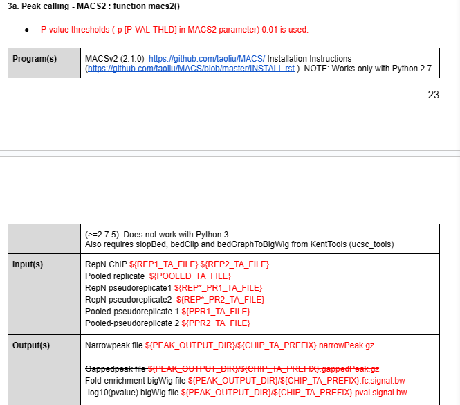

# Nature code
##  Convert PE BAM to tagAlign  
##  Calculate Cross-correlation QC scores: function _xcor()
```
CC_SCORES_FILE="${SUBSAMPLED_TA_FILE}.cc.qc"
CC_PLOT_FILE="${SUBSAMPLED_TA_FILE}.cc.plot.pdf"

# CC_SCORE FILE format
# Filename <tab> numReads <tab> estFragLen <tab> corr_estFragLen <tab> PhantomPeak <tab> corr_phantomPeak <tab> argmin_corr <tab> min_corr <tab> phantomPeakCoef <tab> relPhantomPeakCoef <tab> QualityTag

Rscript $(which run_spp.R) -c=${SUBSAMPLED_TA_FILE} -p=${NTHREADS} -filtchr=chrM -savp=${CC_PLOT_FILE} -out=${CC_SCORES_FILE}

sed -r 's/,[^\t]+//g' ${CC_SCORES_FILE} > temp
mv temp ${CC_SCORES_FILE}
```  
    


##  Generate self-pseudoreplicates for each replicate (SE datasets): function _spr()

```bash
# ========================
# Create pseudoReplicates
# =======================
PR_PREFIX="${OFPREFIX}.filt.nodup"
PR1_TA_FILE="${PR_PREFIX}.SE.pr1.tagAlign.gz"
PR2_TA_FILE="${PR_PREFIX}.SE.pr2.tagAlign.gz"

# Get total number of read pairs
nlines=$( zcat ${FINAL_TA_FILE} | wc -l )
nlines=$(( (nlines + 1) / 2 ))

# Shuffle and split BED file into 2 equal parts
zcat ${FINAL_TA_FILE} | shuf --random-source=<(openssl enc -aes-256-ctr -pass pass:$(zcat -f ${FINAL_TA_FILE} | wc -c) -nosalt </dev/zero 2>/dev/null) | split -d -l ${nlines} - ${PR_PREFIX} # Will produce ${PR_PREFIX}00 and ${PR_PREFIX}01

# Convert reads into standard tagAlign file
gzip -nc “${PR_PREFIX}00" > ${PR1_TA_FILE}
rm "${PR_PREFIX}00"
gzip -nc “${PR_PREFIX}01" > ${PR2_TA_FILE}
rm "${PR_PREFIX}01"
```

## Generate self-pseudoreplicates for each replicate (PE datasets): function _spr_PE()

```bash
# ========================
# Create pseudoReplicates
# =======================
PR_PREFIX="${OFPREFIX}.filt.nodup"
PR1_TA_FILE="${PR_PREFIX}.PE2SE.pr1.tagAlign.gz"
PR2_TA_FILE="${PR_PREFIX}.PE2SE.pr2.tagAlign.gz"
joined=”temp.bedpe”

# Make temporary fake BEDPE file from FINAL_TA_FILE
zcat ${FINAL_TA_FILE} | sed 'N;s/\n/\t/' | gzip -nc > $joined
# Get total number of read pairs
nlines=$( zcat ${joined} | wc -l )
nlines=$(( (nlines + 1) / 2 ))

# Shuffle and split BEDPE file into 2 equal parts
zcat -f ${joined} | shuf --random-source=<(openssl enc -aes-256-ctr -pass pass:$(zcat -f ${FINAL_TA_FILE} | wc -c) -nosalt </dev/zero 2>/dev/null) | split -d -l ${nlines} - ${PR_PREFIX} # Will produce ${PR_PREFIX}00 and ${PR_PREFIX}01

# Convert fake BEDPE  to reads into standard tagAlign file
awk 'BEGIN{OFS="\t"}{printf "%s\t%s\t%s\t%s\t%s\t%s\n%s\t%s\t%s\t%s\t%s\t%s\n",$1,$2,$3,$4,$5,$6,$7,$8,$9,$10,$11,$12}' "${PR_PREFIX}00" | gzip -nc > ${PR1_TA_FILE}
rm "${PR_PREFIX}00"
awk 'BEGIN{OFS="\t"}{printf "%s\t%s\t%s\t%s\t%s\t%s\n%s\t%s\t%s\t%s\t%s\t%s\n",$1,$2,$3,$4,$5,$6,$7,$8,$9,$10,$11,$12}' "${PR_PREFIX}01" | gzip -nc > ${PR2_TA_FILE}
rm "${PR_PREFIX}01"
rm $joined
```  

  

## Generate pooled dataset and pooled-pseudoreplicates : function _ppr()  

```bash
# ========================
# Create pooled datasets
# =======================
REP1_TA_FILE=”${DATASET_PREFIX}.Rep1.tagAlign.gz”
REP2_TA_FILE=”${DATASET_PREFIX}.Rep2.tagAlign.gz”
POOLED_TA_FILE=”${DATASET_PREFIX}.Rep0.tagAlign.gz”

zcat ${REP1_TA_FILE} ${REP2_TA_FILE} | gzip -nc > ${POOLED_TA_FILE}

# ========================
# Create pooled pseudoreplicates
# =======================
REP1_PR1_TA_FILE=”${DATASET_PREFIX}.Rep1.pr1.tagAlign.gz”
REP1_PR2_TA_FILE=”${DATASET_PREFIX}.Rep1.pr2.tagAlign.gz”

REP2_PR1_TA_FILE=”${DATASET_PREFIX}.Rep2.pr1.tagAlign.gz”
REP2_PR2_TA_FILE=”${DATASET_PREFIX}.Rep2.pr2.tagAlign.gz”

PPR1_TA_FILE=”${DATASET_PREFIX}.Rep0.pr1.tagAlign.gz”
PPR2_TA_FILE=”${DATASET_PREFIX}.Rep0.pr1.tagAlign.gz”

zcat ${REP1_PR1_TA_FILE} ${REP2_PR1_TA_FILE} | gzip -nc > ${PPR1_TA_FILE}
zcat ${REP1_PR2_TA_FILE} ${REP2_PR2_TA_FILE} | gzip -nc > ${PPR2_TA_FILE}
#先形成了各自的假重复，再合并为一个pool
```
  

## Tn5_shift
## Calculate Jensen-Shannon distance (JSD): _jsd()  
```bash
NTH=4 # number of threads

# BAMs are blacklist-filtered first for each replicate
NODUP_BFILT_BAM_REP1=${NODUP_BAM_REP1}.bfilt.bam
NODUP_BFILT_BAM_REP2=${NODUP_BAM_REP2}.bfilt.bam

bedtools intersect -nonamecheck -v -abam ${NODUP_BAM_REP1} -b ${BLACKLIST} > ${NODUP_BFILT_BAM_REP1}'

# remove v=blacklist
bedtools intersect -nonamecheck -v -abam ${NODUP_BAM_REP2} -b ${BLACKLIST} > ${NODUP_BFILT_BAM_REP2}'

LC_ALL=en_US.UTF-8 LANG=en_US.UTF-8 plotFingerprint -b ${NODUP_BFILT_BAM_REP1} ${NODUP_BFILT_BAM_REP2} --labels rep1 rep2 --outQualityMetrics ${JSD_LOG} --minMappingQuality ${MAPQ_THRESH} -T "Fingerprints of different samples" --numberOfProcessors ${NTH} --plotFile ${JSD_PLOT}
```
   

## Calculate GC bias: _gc_bias()  
```bash
# we don’t use plot directly generated from picard
# we process picard’s text output and make a plot

java -Xmx6G -XX:ParallelGCThreads=1 -jar \
picard.jar \
CollectGcBiasMetrics R=${REF_FA} I=${NODUP_BAM} O=${GC_BIAS_LOG} \
USE_JDK_DEFLATER=TRUE USE_JDK_INFLATER=TRUE \
VERBOSITY=ERROR QUIET=TRUE \
ASSUME_SORTED=FALSE \
CHART=${GC_BIAS_PLOT} S=summary.txt
```
```python
# use ${GC_BIAS_LOG} into the following pyhton script
# data_file: ${GC_BIAS_LOG}
# prefix: any good prefix for output file name

def plot_gc(data_file, prefix):
    '''
    Replot the Picard output as png file to put into the html
    '''
    # Load data
    data = pd.read_table(data_file, comment="#")

    # Plot the data
    fig = plt.figure()
    ax = fig.add_subplot(111)

    plt.xlim((0, 100))

    lin1 = ax.plot(data['GC'], data['NORMALIZED_COVERAGE'],
                   label='Normalized coverage', color='r')
    ax.set_ylabel('Normalized coverage')

    ax2 = ax.twinx()
    lin2 = ax2.plot(data['GC'], data['MEAN_BASE_QUALITY'],
                    label='Mean base quality at GC%', color='b')
    ax2.set_ylabel('Mean base quality at GC%')

    ax3 = ax.twinx()
    lin3 = ax3.plot(data['GC'], data['WINDOWS']/np.sum(data['WINDOWS']),
                    label='Windows at GC%', color='g')
    ax3.get_yaxis().set_visible(False)

    lns = lin1 + lin2 + lin3
    labs = [l.get_label() for l in lns]
    ax.legend(lns, labs, loc='best')

    # plot_img = BytesIO()
    # fig.savefig(plot_img, format='png')
    prefix = data_file.rstrip('.gc.txt')
    plot_png = prefix + '.gc_plot.png'
    fig.savefig(plot_png, format='png')
```
  


## Fragment length statistics (PE only): _frag_len_stat()

```bash
# intermediate files
# ${INSERT_DATA}
# ${INSERT_PLOT}

java -Xmx6G -XX:ParallelGCThreads=1 -jar \
picard.jar \
CollectInsertSizeMetrics \
INPUT=${NODUP_BAM} OUTPUT=${INSERT_DATA} H=${INSERT_PLOT} \
VERBOSITY=ERROR QUIET=TRUE \
USE_JDK_DEFLATER=TRUE USE_JDK_INFLATER=TRUE \
W=1000 STOP_AFTER=5000000
```
```python
# using an intermediate file ${INSERT_DATA}
# generate Nucleosomeal QC ${NUCLEOSOMAL_QC} and
# Fragment length distribution plot ${FRAGLEN_DIST_PLOT}
# OUTPUT_PREFIX: output file prefix

    nucleosomal_qc = fragment_length_qc(read_picard_histogram(insert_data),
                                        OUTPUT_PREFIX)

    fraglen_dist_plot = fragment_length_plot(insert_data, OUTPUT_PREFIX)


QCResult = namedtuple('QCResult', ['metric', 'qc_pass', 'message'])
INF = float("inf")


class QCCheck(object):
    def __init__(self, metric):
        self.metric = metric

    def check(self, value):
        return True

    def message(self, value, qc_pass):
        return ('{}\tOK'.format(value) if qc_pass
                else '{}\tFailed'.format(value))

    def __call__(self, value):
        qc_pass = self.check(value)
        return QCResult(self.metric, qc_pass, self.message(value, qc_pass))


class QCIntervalCheck(QCCheck):
    def __init__(self, metric, lower, upper):
        super(QCIntervalCheck, self).__init__(metric)
        self.lower = lower
        self.upper = upper

    def check(self, value):
        return self.lower <= value <= self.upper

    def message(self, value, qc_pass):
        return ('{}\tOK'.format(value) if qc_pass else
                '{}\tout of range [{}, {}]'.format(value, self.lower,
                                                  self.upper))


class QCLessThanEqualCheck(QCIntervalCheck):
    def __init__(self, metric, upper):
        super(QCLessThanEqualCheck, self).__init__(metric, -INF, upper)


class QCGreaterThanEqualCheck(QCIntervalCheck):
    def __init__(self, metric, lower):
        super(QCGreaterThanEqualCheck, self).__init__(metric, lower, INF)


class QCHasElementInRange(QCCheck):
    def __init__(self, metric, lower, upper):
        super(QCHasElementInRange, self).__init__(metric)
        self.lower = lower
        self.upper = upper

    def check(self, elems):
        return (len([elem for elem in elems
                    if self.lower <= elem <= self.upper]) > 0)

    def message(self, elems, qc_pass):
        return ('OK' if qc_pass else
                'Cannot find element in range [{}, {}]'.format(
                    self.lower, self.upper))


def read_picard_histogram(data_file):
    with open(data_file) as fp:
        for line in fp:
            if line.startswith('## HISTOGRAM'):
                break
        data = np.loadtxt(fp, skiprows=1)

    return data

def get_insert_distribution(final_bam, prefix):
    '''
    Calls Picard CollectInsertSizeMetrics
    '''
    logging.info('insert size distribution...')
    insert_data = '{0}.inserts.hist_data.log'.format(prefix)
    insert_plot = '{0}.inserts.hist_graph.pdf'.format(prefix)
    graph_insert_dist = ('java -Xmx6G -XX:ParallelGCThreads=1 -jar '
                         '{3} '
                         'CollectInsertSizeMetrics '
                         'INPUT={0} OUTPUT={1} H={2} '
                         'VERBOSITY=ERROR QUIET=TRUE '
                         'USE_JDK_DEFLATER=TRUE USE_JDK_INFLATER=TRUE '
                         'W=1000 STOP_AFTER=5000000').format(final_bam,
                                                             insert_data,
                                                             insert_plot,
                                                             locate_picard())
    logging.info(graph_insert_dist)
    os.system(graph_insert_dist)
    return insert_data, insert_plot

def fragment_length_qc(data, prefix):
    results = []

    NFR_UPPER_LIMIT = 150
    MONO_NUC_LOWER_LIMIT = 150
    MONO_NUC_UPPER_LIMIT = 300

    # % of NFR vs res
    nfr_reads = data[data[:,0] < NFR_UPPER_LIMIT][:,1]
    percent_nfr = nfr_reads.sum() / data[:,1].sum()
    results.append(
        QCGreaterThanEqualCheck('Fraction of reads in NFR', 0.4)(percent_nfr))

    # % of NFR vs mononucleosome
    mono_nuc_reads = data[
        (data[:,0] > MONO_NUC_LOWER_LIMIT) &
        (data[:,0] <= MONO_NUC_UPPER_LIMIT)][:,1]
    
    percent_nfr_vs_mono_nuc = (
        nfr_reads.sum() /
        mono_nuc_reads.sum())
    results.append(
        QCGreaterThanEqualCheck('NFR / mono-nuc reads', 2.5)(
            percent_nfr_vs_mono_nuc))

    # peak locations
    pos_start_val = data[0,0] # this may be greater than 0
    peaks = find_peaks_cwt(data[:, 1], np.array([25]))
    nuc_range_metrics = [('Presence of NFR peak', 20 - pos_start_val, 90 - pos_start_val),
                         ('Presence of Mono-Nuc peak', 120 - pos_start_val, 250 - pos_start_val),
                         ('Presence of Di-Nuc peak', 300 - pos_start_val, 500 - pos_start_val)]
    for range_metric in nuc_range_metrics:
        results.append(QCHasElementInRange(*range_metric)(peaks))

    out = prefix + '.nucleosomal.qc'
    with open(out, 'w') as fp:
        for elem in results:            
            fp.write('\t'.join([elem.metric, str(elem.qc_pass), elem.message]) + '\n')

    return out

def fragment_length_plot(data_file, prefix, peaks=None):
    try:
        data = read_picard_histogram(data_file)
    except IOError:
        return ''
    except TypeError:
        return ''

    fig = plt.figure()
    plt.bar(data[:, 0], data[:, 1])
    plt.xlim((0, 1000))

    if peaks:
        peak_vals = [data[peak_x, 1] for peak_x in peaks]
        plt.plot(peaks, peak_vals, 'ro')

    # plot_img = BytesIO()
    # fig.savefig(plot_img, format='png')
    plot_png = prefix + '.fraglen_dist.png'
    fig.savefig(plot_png, format='png')

    return plot_png
```
  


# Call peaks on replicates, self-pseudoreplicates, pooled data and pooled-pseudoreplicates  
## Peak calling - MACS2 : function macs2()
```bash
prefix_sig = “$prefix”

peakfile     = "$prefix.narrowPeak.gz"
pval_thresh = 0.01
NPEAKS=300000 # capping number of peaks called from MACS2

fc_bedgraph     = "$prefix.fc.signal.bedgraph"
fc_bedgraph_srt    = "$prefix.fc.signal.srt.bedgraph"    
fc_bigwig     = "$prefix_sig.fc.signal.bigwig"

pval_bedgraph     = "$prefix.pval.signal.bedgraph"
pval_bedgraph_srt     = "$prefix.pval.signal.srt.bedgraph"    
pval_bigwig     = "$prefix_sig.pval.signal.bigwig"

smooth_window=150 # default
shiftsize=$(( -$smooth_window/2 ))

macs2 callpeak \
    -t $tag -f BED -n "$prefix" -g "$gensz" -p $pval_thresh \
   --shift $shiftsize  --extsize $smooth_window --nomodel -B --SPMR --keep-dup all --call-summits

# Sort by Col8 in descending order and replace long peak names in Column 4 with Peak_<peakRank>
sort -k 8gr,8gr "$prefix"_peaks.narrowPeak | awk 'BEGIN{OFS="\t"}{$4="Peak_"NR ; print $0}' | head -n ${NPEAKS} | gzip -nc > $peakfile
rm -f "$prefix"_peaks.narrowPeak
rm -f "$prefix"_peaks.xls
rm -f "$prefix"_summits.bed


macs2 bdgcmp -t "$prefix"_treat_pileup.bdg -c "$prefix"_control_lambda.bdg
    --o-prefix "$prefix" -m FE
slopBed -i "$prefix"_FE.bdg -g "$chrsz" -b 0 | bedClip stdin "$chrsz" $fc_bedgraph
rm -f "$prefix"_FE.bdg

sort -k1,1 -k2,2n $fc_bedgraph > $fc_bedgraph_srt
bedGraphToBigWig $fc_bedgraph_srt "$chrsz" "$fc_bigwig"
rm -f $fc_bedgraph $fc_bedgraph_srt

# sval counts the number of tags per million in the (compressed) BED file
sval=$(wc -l <(zcat -f "$tag") | awk '{printf "%f", $1/1000000}')

macs2 bdgcmp
    -t "$prefix"_treat_pileup.bdg -c "$prefix"_control_lambda.bdg
    --o-prefix "$prefix" -m ppois -S "${sval}"
slopBed -i "$prefix"_ppois.bdg -g "$chrsz" -b 0 | bedClip stdin "$chrsz" $pval_bedgraph
rm -f "$prefix"_ppois.bdg

sort -k1,1 -k2,2n $pval_bedgraph > $pval_bedgraph_srt
bedGraphToBigWig $pval_bedgraph_srt "$chrsz" "$pval_bigwig"
rm -f $pval_bedgraph $pval_bedgraph_srt


rm -f "$prefix"_treat_pileup.bdg "$prefix"_control_lambda.bdg
```
  

## Blacklist filtering for peaks : function blacklist_filter_peak()  

  


## bed to bigbed conversion for narrowpeaks : function _narrowpeak_to_bigbed() 

  

## Naive overlap thresholding for MACS2 peak calls : function naive_overlap_peak()

These are peaks in the pooled data (reads pooled across reps) that overlap peaks in BOTH true replicates OR overlap peaks in BOTH pooled pseudoreplicates. Repeat this procedure for 4 sets of peaks described in Section 4. ——对可重复peaak的筛选过程  

```bash
# ======================
# For narrowPeak files
# ======================

# Find pooled peaks that overlap Rep1 and Rep2 where overlap is defined as the fractional overlap wrt any one of the overlapping peak pairs  >= 0.5

intersectBed -wo -a Pooled.narrowPeak.gz -b Rep1.narrowPeak.gz | 
awk 'BEGIN{FS="\t";OFS="\t"}{s1=$3-$2; s2=$13-$12; if (($21/s1 >= 0.5) || ($21/s2 >= 0.5)) {print $0}}' | cut -f 1-10 | sort | uniq | 
intersectBed -wo -a stdin -b Rep2.narrowPeak.gz | 
awk 'BEGIN{FS="\t";OFS="\t"}{s1=$3-$2; s2=$13-$12; if (($21/s1 >= 0.5) || ($21/s2 >= 0.5)) {print $0}}' | cut -f 1-10 | sort | uniq > PooledInRep1AndRep2.narrowPeak.gz

# =============================
# Filter using black list
# =============================
bedtools intersect -v -a PooledInRep1AndRep2.narrowPeak.gz -b ${BLACKLIST} | awk 'BEGIN{OFS="\t"} {if ($5>1000) $5=1000; print $0}' | grep -P 'chr[\dXY]+[ \t]'  | gzip -nc > PooledInRep1AndRep2.filt.narrowPeak.gz


# 下面不用管
# ======================
For BroadPeak files (there is just a difference is the awk commands wrt the column numbers)
# ======================

# Find pooled peaks that overlap Rep1 and Rep2 where overlap is defined as the fractional overlap wrt any one of the overlapping peak pairs  >= 0.5

intersectBed -wo -a Pooled.broadPeak.gz -b Rep1.broadPeak.gz | 
awk 'BEGIN{FS="\t";OFS="\t"}{s1=$3-$2; s2=$12-$11; if (($19/s1 >= 0.5) || ($19/s2 >= 0.5)) {print $0}}' | cut -f 1-9 | sort | uniq | 
intersectBed -wo -a stdin -b Rep2.broadPeak.gz | 
awk 'BEGIN{FS="\t";OFS="\t"}{s1=$3-$2; s2=$12-$11; if (($19/s1 >= 0.5) || ($19/s2 >= 0.5)) {print $0}}' | cut -f 1-9 | sort | uniq > PooledInRep1AndRep2.broadPeak.gz

# Find pooled peaks that overlap PooledPseudoRep1 and PooledPseudoRep2 where overlap is defined as the fractional overlap wrt any one of the overlapping peak pairs  >= 0.5

intersectBed -wo -a Pooled.broadPeak.gz -b PsRep1.broadPeak.gz | 
awk 'BEGIN{FS="\t";OFS="\t"}{s1=$3-$2; s2=$12-$11; if (($19/s1 >= 0.5) || ($19/s2 >= 0.5)) {print $0}}' | cut -f 1-9 | sort | uniq | 
intersectBed -wo -a stdin -b PsRep2.broadPeak.gz | 
awk 'BEGIN{FS="\t";OFS="\t"}{s1=$3-$2; s2=$12-$11; if (($19/s1 >= 0.5) || ($19/s2 >= 0.5)) {print $0}}' | cut -f 1-9 | sort | uniq > PooledInPsRep1AndPsRep2.broadPeak.gz

# Combine peak lists

zcat PooledInRep1AndRep2.broadPeak.gz PooledInPsRep1AndPsRep2.broadPeak.gz | sort | uniq | awk 'BEGIN{OFS="\t"} {if ($5>1000) $5=1000; print $0}' \
| grep -P 'chr[0-9XY]+(?!_)' > finalPeakList.broadPeak.gz


# ======================
For gappedPeak files (there is just a difference is the awk commands wrt the column numbers)
# ======================

# Find pooled peaks that overlap Rep1 and Rep2 where overlap is defined as the fractional overlap wrt any one of the overlapping peak pairs  >= 0.5

intersectBed -wo -a Pooled.gappedPeak.gz -b Rep1.gappedPeak.gz | 
awk 'BEGIN{FS="\t";OFS="\t"}{s1=$3-$2; s2=$18-$17; if (($31/s1 >= 0.5) || ($31/s2 >= 0.5)) {print $0}}' | cut -f 1-15 | sort | uniq | 
intersectBed -wo -a stdin -b Rep2.gappedPeak.gz | 
awk 'BEGIN{FS="\t";OFS="\t"}{s1=$3-$2; s2=$18-$17; if (($31/s1 >= 0.5) || ($31/s2 >= 0.5)) {print $0}}' | cut -f 1-15 | sort | uniq > PooledInRep1AndRep2.gappedPeak.gz

# Find pooled peaks that overlap PooledPseudoRep1 and PooledPseudoRep2 where overlap is defined as the fractional overlap wrt any one of the overlapping peak pairs  >= 0.5

intersectBed -wo -a Pooled.gappedPeak.gz -b PsRep1.gappedPeak.gz | 
awk 'BEGIN{FS="\t";OFS="\t"}{s1=$3-$2; s2=$18-$17; if (($31/s1 >= 0.5) || ($31/s2 >= 0.5)) {print $0}}' | cut -f 1-15 | sort | uniq | 
intersectBed -wo -a stdin -b PsRep2.gappedPeak.gz | 
awk 'BEGIN{FS="\t";OFS="\t"}{s1=$3-$2; s2=$18-$17; if (($31/s1 >= 0.5) || ($31/s2 >= 0.5)) {print $0}}' | cut -f 1-15 | sort | uniq > PooledInPsRep1AndPsRep2.gappedPeak.gz

# Combine peak lists

zcat PooledInRep1AndRep2.gappedPeak.gz PooledInPsRep1AndPsRep2.gappedPeak.gz | sort | uniq | awk 'BEGIN{OFS="\t"} {if ($5>1000) $5=1000; print $0}' \
| grep -P 'chr[0-9XY]+(?!_)' > finalPeakList.gappedPeak.gz
```
  

# Run IDR on all pairs of replicates, self-pseudoreplicates and pooled pseudoreplicates  

IDR is optional. The IDR peaks are a subset of the naive overlap peaks that pass a specific IDR threshold of 5%.

```Use IDR to compare all pairs of matched replicates : function _idr()
(1) True replicates narrowPeak files: ${REP1_PEAK_FILE} vs. ${REP2_PEAK_FILE} IDR results transferred to Pooled-replicates narrowPeak file  ${POOLED_PEAK_FILE}
(2) Pooled-pseudoreplicates: ${PPR1_PEAK_FILE} vs. ${PPR2_PEAK_FILE} IDR results transferred to Pooled-replicates narrowPeak file ${POOLED_PEAK_FILE}
(3) Rep1 self-pseudoreplicates: ${REP1_PR1_PEAK_FILE} vs. ${REP1_PR2_PEAK_FILE} IDR results transferred to Rep1 narrowPeak file ${REP1_PEAK_FILE}
(4) Rep2 self-pseudoreplicates: ${REP2_PR1_PEAK_FILE} vs. ${REP2_PR2_PEAK_FILE} IDR results transferred to Rep2 narrowPeak file ${REP2_PEAK_FILE}

IDR Threshold: Use IDR threshold of 5% for all pairwise analyses
```


