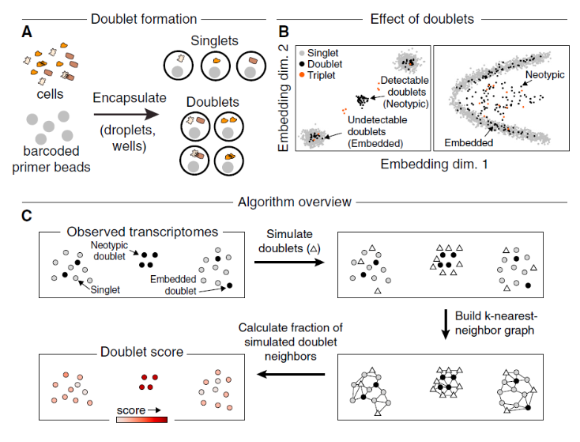

# 去除单细胞测序中的双细胞情况  

[原文链接](https://doi.org/10.1016/j.cels.2018.11.005)  

## 简介  

单细胞转录组测序方法可能导致2个或以上的细胞共用一个barcode，形成doublets或multiplets，进而表现出“杂交”（hybrid）的转录组特征。这些doublets可能干扰下游数据分析。因此需要在下游分析之前去除。  

## 引言  

在此之前，主要有两种简单的方法用来排除潜在的doublets：  

* 去除检测到转录本数量（UMI）过高的细胞。通常效果不佳，因为它需要预先假设所有细胞含有的RNA量相似；  
* 去除表达不同细胞类型marker基因的聚类。其缺点是需要大量生物学专业知识和对细胞类型的谨慎注释。  

## Doublets/Multiplets分类    

  

Multiplets对下游分析的影响，部分取决于它们是否来源于具有不同基因表达谱的细胞。作者因此定义了两种主要的multiplets相关错误：  

* ”Embedded“：multiplets可能来源于转录特征相似的细胞，它们被聚类到一大群主导某特定细胞状态的singlets中，仅仅表现为基因表达定量和丰度的改变。如果这种误差发生率不高，对下游分析的影响应该很小；  

* ”Neotypic“：multiplets可能源自转录特征不同的细胞，例如不同的细胞谱系、成熟度、空间定位、活化程度等。它们可能形成新的聚类分支，或不同聚类之间的”桥梁“，因此可能在数据推断时导致质变的错误。  

在实际操作中，单个multiplet可能被分类为”embeded“或”neotypic“（或其他类型），但其与两类误差的相关程度取决于单细胞数据分析的方式。例如，某种降维方式可能无法区分出multiplets，进而指向”embedded“错误，而另一种降维方式可能成功区分multiplets，进而指向”Neotypic“错误。因此，针对特定的数据分析方法，有效区分neotypic multiplets应该具有可操作性。  

## Scrublet方法  

当预先知道doublets在全部数据中的期望比例时，分类器能输出某个给定细胞是doublet的后验似然性（posterior likelihood）。然而，doublets的比例难以预先得知。基于模拟doublets的分类器评分大部分是双峰分布，Scrublet据此使用阈值似然性来区分doublets。  

低分doublets可能提示其难以从singlets中区分，也即”embeded“，而高分doublets可能与singlets状态不同，即”neotypic“。

## Scrublet输出结果 

1. 预测的可检测到的doublet比例（A predicted "detectable doublet fraction"）`ϕD`;  
2. 每个细胞的doublet评分，也可解释成在该数据中，若给定doublet比例，则某个细胞是doublet的后验似然性;  
3. doublet评分的标准误;  
4. 每个细胞是否neotypic doublet的二分类标签（True or false）。如果期望doublet比例是 `ρ`，那么整个数据中neotypic doublets的比例就是 `ρ⋅ϕD`，而 `ρ⋅(1−ϕD)`则是无法检测到的embedded doublets。  

在合成模拟的doublets后，Scrublet利用主成分分析（principal-component analysis，PCA）降维，再构建kNN分类器，不需要聚类数据或预先定义细胞marker基因，并且仅用几分钟就能完成上万个细胞的doublet鉴定。  

## 讨论
Scrublet的效果就不赘述了。基于其底层的假设，Scrublet仍然存在一些不足和限制：  

1. 如果形成doublets的某种细胞类型没有包括在数据中，Scrublet就不能检测到这种特定的doublets。也就是说，`数据本身需要较充分地代表样本中的细胞异质性`；  

2. Scrublet只能识别出neotypic doublets，而难以识别出包含在主要细胞聚类内部的embedded doublets。然而，作者认为embeded doublets对下游分析的影响较小，检测不到也不要紧。换句话说，如果某些doublets已经可以显著影响下游的聚类分析，那么它通常是形成了不同于任何singlets的转录特征，理应能被Scrublet的算法识别出来；  

3. 根据github的教程，作者不推荐在合并数据集中使用Scrublet，而是应该在各个文库中分别使用Scrublet来去除doublets。  

